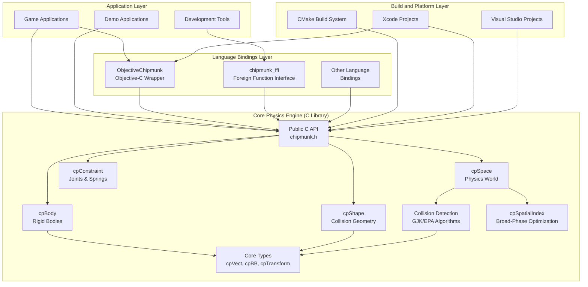
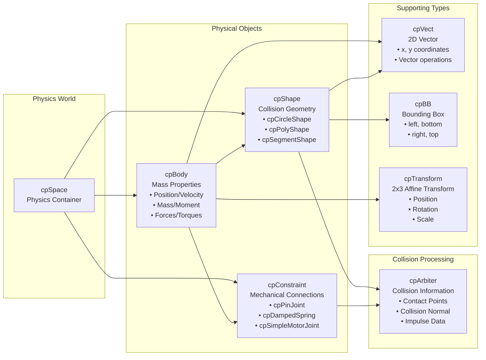
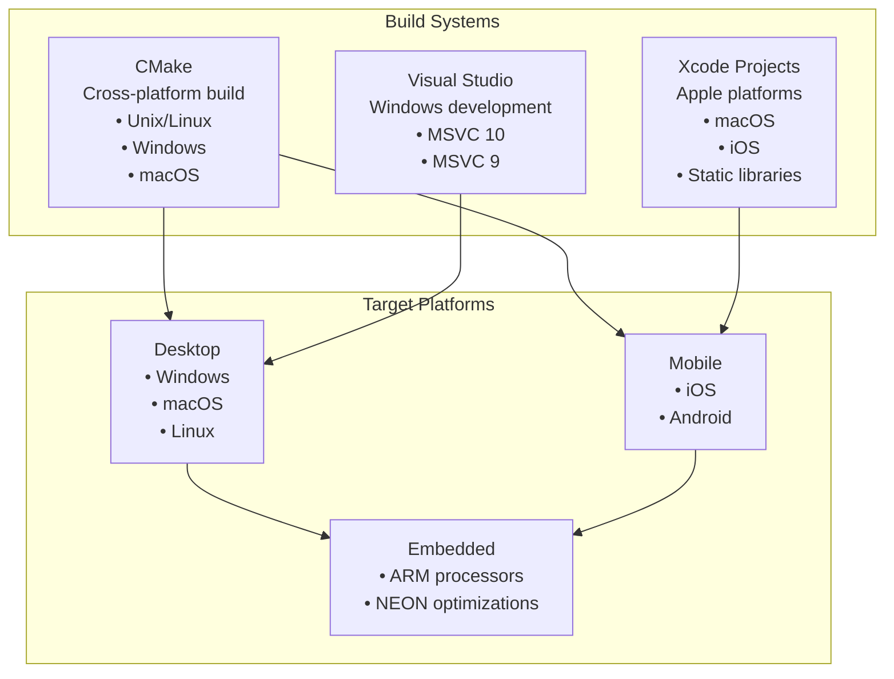

# Chipmunk2D Overview

Relevant source files

The following files were used as context for generating this wiki page:

- [LICENSE.txt](LICENSE.txt)
- [README.textile](README.textile)
- [TODO.txt](TODO.txt)
- [VERSION.txt](VERSION.txt)
- [doc-src/chipmunk-docs.textile](doc-src/chipmunk-docs.textile)
- [include/chipmunk/chipmunk.h](include/chipmunk/chipmunk.h)
- [src/CMakeLists.txt](src/CMakeLists.txt)
- [src/chipmunk.c](src/chipmunk.c)

This document provides an overview of the Chipmunk2D physics engine, introducing its core purpose, key features, and overall system architecture. It serves as the entry point for understanding how the various components of the physics engine work together to provide 2D rigid body simulation.

For detailed information about specific subsystems, see [Core Physics Engine](#2), [API and Integration](#3), and [Advanced Features](#4).

## What is Chipmunk2D?

Chipmunk2D is a simple, lightweight, fast and portable 2D rigid body physics library written in C. It provides real-time physics simulation capabilities specifically designed for 2D video games and interactive applications. The library is distributed under the MIT license, making it freely available for both commercial and non-commercial use.

The primary goal of Chipmunk2D is to give 2D developers access to the same quality of physics simulation found in modern 3D games, while maintaining simplicity and performance optimized for 2D scenarios.

**Sources:** [README.textile:9-11](), [doc-src/chipmunk-docs.textile:5-9]()

## Key Features and Capabilities

Chipmunk2D provides a comprehensive set of physics simulation features:

| Feature Category | Capabilities |
|------------------|-------------|
| **Collision Primitives** | Circle, convex polygon, and beveled line segment shapes |
| **Multi-Shape Bodies** | Multiple collision primitives can be attached to a single rigid body |
| **Collision Detection** | Fast broad-phase using bounding box trees or spatial hashing |
| **Contact Solving** | Extremely fast impulse solving using Erin Catto's contact persistence algorithm |
| **Performance Optimization** | Sleeping objects, spatial indexing, and optional multithreading |
| **Collision Callbacks** | Event-based collision handling with user-definable object types |
| **Collision Filtering** | Flexible system with layers, exclusion groups, and callbacks |
| **Spatial Queries** | Point, segment (raycasting), shape, and bounding box queries |
| **Joints and Constraints** | Large variety of joints for vehicles, ragdolls, and mechanical systems |
| **Cross-Platform** | Lightweight C99 implementation with no external dependencies |

**Sources:** [README.textile:13-33](), [doc-src/chipmunk-docs.textile:115-121]()

## Core Architecture Overview

Chipmunk2D follows a modular architecture with distinct layers for core physics simulation, language bindings, and applications:

**Sources:** [include/chipmunk/chipmunk.h:44-127](), [src/CMakeLists.txt:1-60]()

## Core Object Types

The physics simulation revolves around four fundamental object types that map directly to C structures in the codebase:

**Sources:** [include/chipmunk/chipmunk.h:85-111](), [doc-src/chipmunk-docs.textile:115-122]()

## Physics Simulation Process

The core simulation operates through a step-based process managed by `cpSpace`:

| Phase | Function | Purpose |
|-------|----------|---------|
| **Integration** | Position/Velocity Updates | Apply forces and update object positions |
| **Broad Phase** | `cpSpatialIndex` | Identify potentially colliding object pairs |
| **Narrow Phase** | `cpCollide` functions | Calculate exact collision information |
| **Constraint Solving** | Impulse Solver | Resolve collisions and joint constraints |
| **Callbacks** | User-defined handlers | Handle collision events and custom logic |

**Sources:** [doc-src/chipmunk-docs.textile:113-122]()

## Version and Compatibility

Chipmunk2D is currently at version 7.0.3, representing a mature and stable API. Key version information is defined in the main header:

- **Major Version:** 7 - Significant API changes and new features
- **Minor Version:** 0 - Feature additions within API compatibility
- **Patch Version:** 3 - Bug fixes and minor improvements

The library maintains backward compatibility within major versions and provides migration guidance for major version upgrades.

**Sources:** [include/chipmunk/chipmunk.h:128-131](), [src/chipmunk.c:59](), [src/CMakeLists.txt:7-11]()

## Language Bindings and Integration

While the core engine is written in C, Chipmunk2D supports multiple programming languages:

| Binding Type | Implementation | Target Languages |
|--------------|----------------|------------------|
| **Native C API** | `chipmunk.h` | C, C++, Objective-C |
| **Objective-C Wrapper** | ObjectiveChipmunk | iOS/macOS applications |
| **Foreign Function Interface** | `chipmunk_ffi.h` | Python, Ruby, Lua, etc. |
| **Community Bindings** | Third-party | Java, C#, JavaScript, etc. |

The C API is designed to be easily wrapped by higher-level languages while maintaining full access to all physics engine capabilities.

**Sources:** [include/chipmunk/chipmunk.h:44-46](), [README.textile:31](), [doc-src/chipmunk-docs.textile:14-16]()

## Build System and Platform Support

Chipmunk2D supports multiple build systems and platforms:

**Sources:** [src/CMakeLists.txt:1-60](), [README.textile:39-48]()15:T1f46

