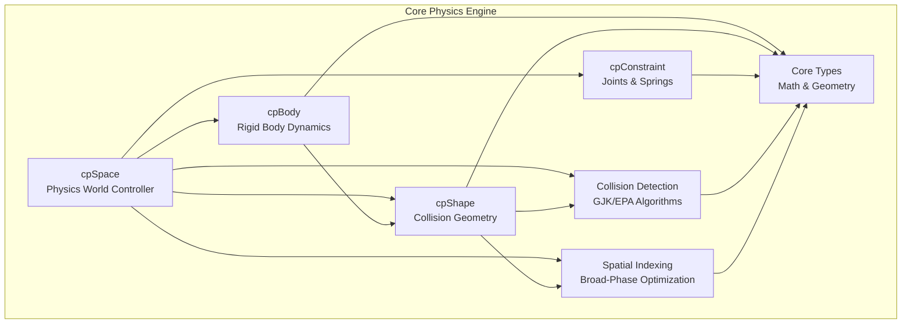
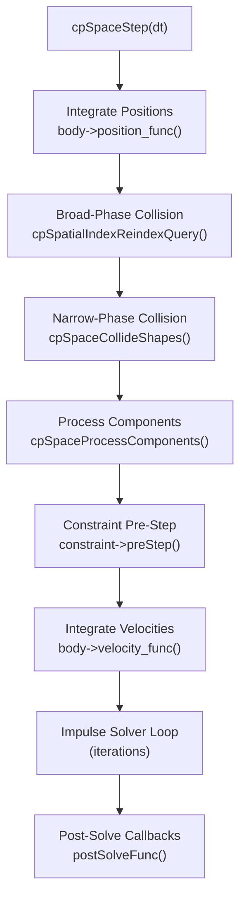
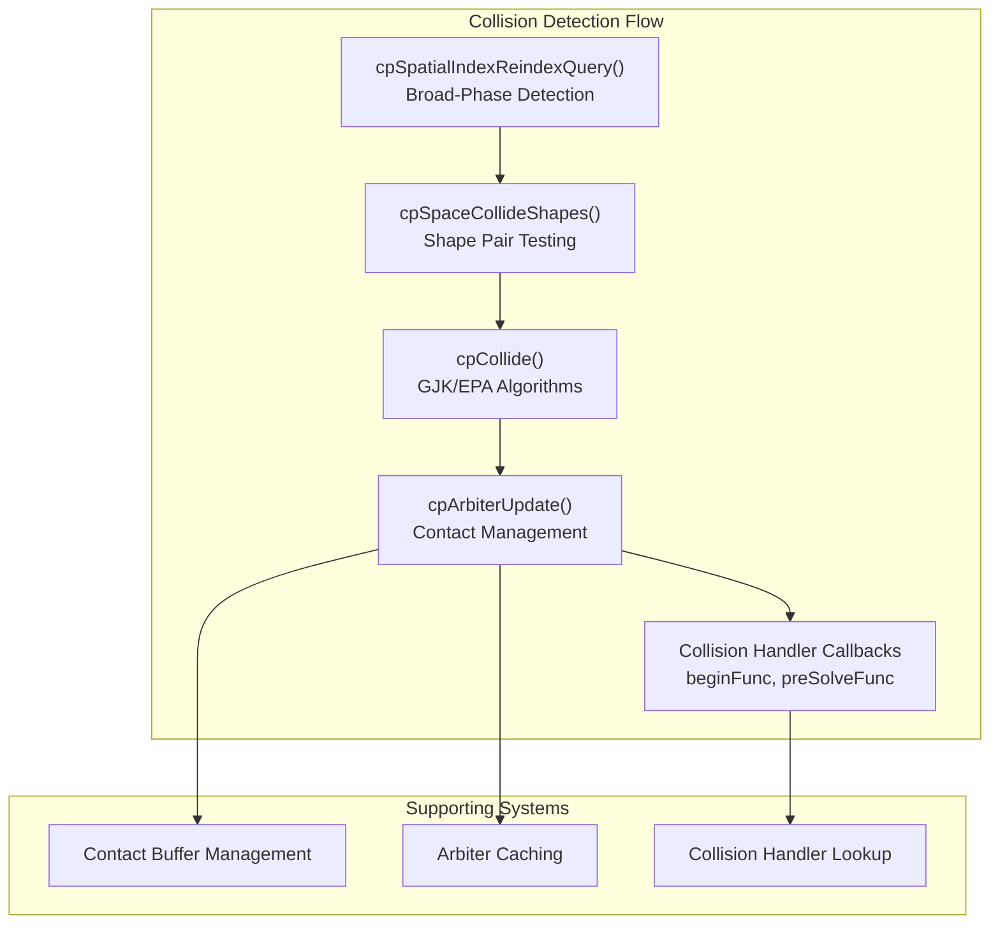
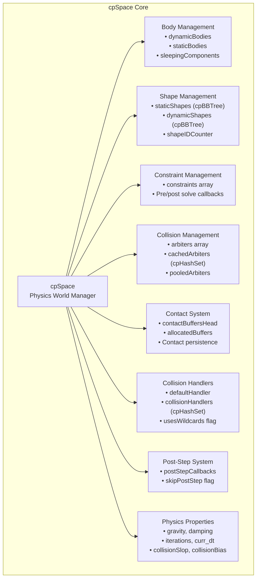
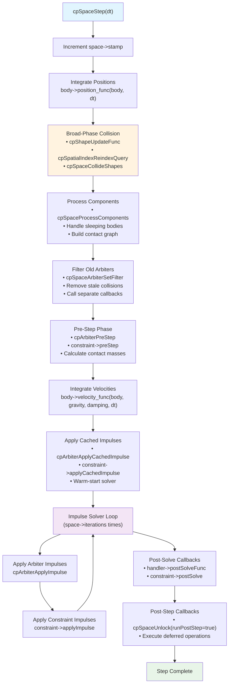
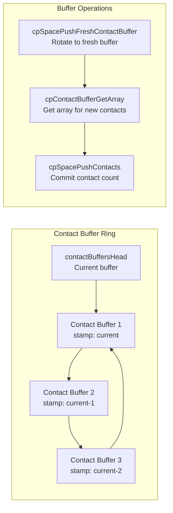
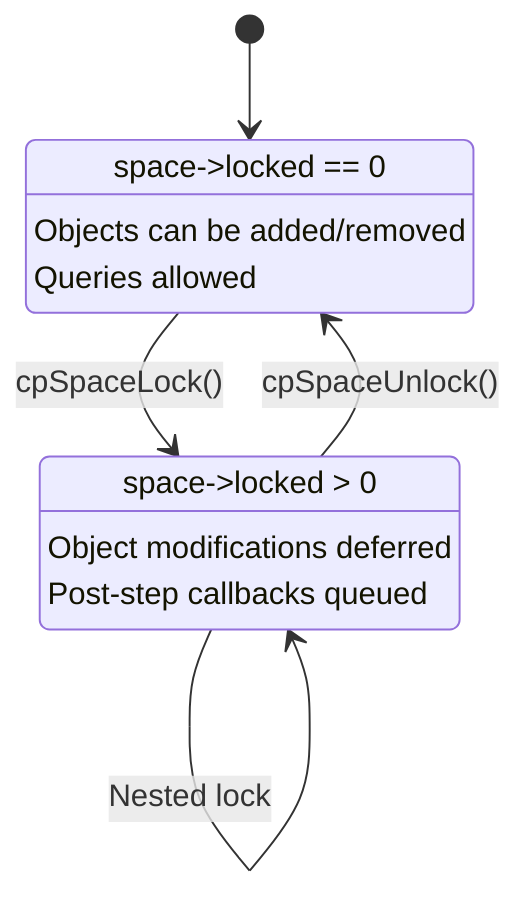

# Core Physics Engine

Relevant source files

The following files were used as context for generating this wiki page:

- [TODO.txt](TODO.txt)
- [VERSION.txt](VERSION.txt)
- [doc-src/chipmunk-docs.textile](doc-src/chipmunk-docs.textile)
- [include/chipmunk/chipmunk.h](include/chipmunk/chipmunk.h)
- [include/chipmunk/chipmunk_private.h](include/chipmunk/chipmunk_private.h)
- [include/chipmunk/cpArbiter.h](include/chipmunk/cpArbiter.h)
- [include/chipmunk/cpSpace.h](include/chipmunk/cpSpace.h)
- [src/CMakeLists.txt](src/CMakeLists.txt)
- [src/chipmunk.c](src/chipmunk.c)
- [src/cpArbiter.c](src/cpArbiter.c)
- [src/cpSpace.c](src/cpSpace.c)
- [src/cpSpaceQuery.c](src/cpSpaceQuery.c)
- [src/cpSpaceStep.c](src/cpSpaceStep.c)

This document provides an overview of Chipmunk2D's core physics engine components implemented in C. These fundamental systems work together to simulate rigid body physics, collision detection, and constraint solving. The core engine forms the foundation that all language bindings and applications build upon.

For information about using the physics engine in applications, see [Public C API](#3.1). For language-specific wrappers, see [Objective-C Bindings](#3.2). For advanced threading features, see [Multithreaded Physics](#4.1).

## Architecture Overview

The Chipmunk2D core engine consists of six primary subsystems that collaborate to provide real-time physics simulation:

Sources: [include/chipmunk/chipmunk.h:88-112](), [src/cpSpace.c:113-183]()

## Primary Components

### Physics World Management (cpSpace)

The `cpSpace` struct serves as the central orchestrator for all physics simulation. It maintains collections of bodies, shapes, and constraints, and coordinates their interactions during each simulation step.

Key responsibilities:
- Managing simulation timestep execution via `cpSpaceStep()`
- Maintaining object collections (`dynamicBodies`, `staticBodies`, `constraints`)
- Coordinating collision detection and response
- Handling post-step callbacks for safe object manipulation

### Rigid Body Dynamics (cpBody)

The `cpBody` struct represents individual rigid bodies with mass, position, velocity, and rotational properties. Bodies can be dynamic (affected by forces), kinematic (controlled programmatically), or static (immovable).

### Collision Geometry (cpShape)

Shape types include `cpCircleShape`, `cpSegmentShape`, and `cpPolyShape`. Shapes define collision boundaries and surface properties (friction, elasticity) but rely on their attached `cpBody` for physical properties.

### Constraints and Joints (cpConstraint)

The constraint system includes various joint types like `cpPinJoint`, `cpPivotJoint`, and `cpDampedSpring`. Constraints connect bodies together and restrict their relative motion.

Sources: [include/chipmunk/chipmunk.h:88-106](), [include/chipmunk/cpSpace.h:39-60]()

## Physics Simulation Pipeline

The core simulation loop in `cpSpaceStep()` follows a carefully orchestrated sequence:

Each step serves a specific purpose in maintaining numerical stability and physical accuracy:

1. **Position Integration**: Updates body positions based on current velocities
2. **Broad-Phase Collision**: Uses spatial indexing to find potential collision pairs
3. **Narrow-Phase Collision**: Performs precise collision detection using GJK/EPA algorithms
4. **Component Processing**: Groups connected bodies for sleeping optimization
5. **Constraint Pre-Step**: Prepares constraints and arbiters for solving
6. **Velocity Integration**: Applies forces and gravity to body velocities
7. **Impulse Solver**: Iteratively resolves collisions and constraint violations
8. **Post-Solve**: Executes user callbacks with final collision information

Sources: [src/cpSpaceStep.c:336-445]()

## Memory Management Architecture

Chipmunk2D follows consistent allocation patterns across all major types:

| Pattern | Function Examples | Purpose |
|---------|-------------------|---------|
| **Alloc/Init/Free** | `cpSpaceAlloc()`, `cpSpaceInit()`, `cpSpaceFree()` | Manual memory control |
| **New/Free** | `cpSpaceNew()`, `cpSpaceFree()` | Simplified allocation |
| **Object Pooling** | Contact buffers, arbiters | Performance optimization |

The engine uses object pooling for frequently allocated structures like collision contacts and arbiters to minimize allocation overhead during simulation.

Sources: [src/cpSpace.c:113-229](), [src/cpSpaceStep.c:121-202]()

## Collision Detection System Integration

The collision detection system operates in two phases integrated with the spatial indexing:

The system maintains persistent collision information through arbiters, which track collision pairs across multiple simulation steps for contact warming and efficient solving.

Sources: [src/cpSpaceStep.c:235-289](), [src/cpArbiter.c:356-414]()

## Core Type System

All physics calculations build upon fundamental geometric and mathematical types:

- **`cpVect`**: 2D vector with extensive mathematical operations
- **`cpBB`**: Axis-aligned bounding box for spatial queries
- **`cpTransform`**: 2x3 affine transformation matrix
- **`cpFloat`**: Configurable floating-point precision (default: `double`)

These types provide the mathematical foundation for all physics operations and can be customized at compile time to meet specific precision or performance requirements.

Sources: [include/chipmunk/chipmunk.h:60-61](), [include/chipmunk/chipmunk.h:113-116]()16:T2dca,# Physics Simulation (cpSpace)

Relevant source files

The following files were used as context for generating this wiki page:

- [include/chipmunk/chipmunk_private.h](include/chipmunk/chipmunk_private.h)
- [include/chipmunk/cpArbiter.h](include/chipmunk/cpArbiter.h)
- [include/chipmunk/cpSpace.h](include/chipmunk/cpSpace.h)
- [src/cpArbiter.c](src/cpArbiter.c)
- [src/cpSpace.c](src/cpSpace.c)
- [src/cpSpaceQuery.c](src/cpSpaceQuery.c)
- [src/cpSpaceStep.c](src/cpSpaceStep.c)

The `cpSpace` system is the central physics world manager that orchestrates all aspects of the physics simulation in Chipmunk2D. It manages rigid bodies, collision shapes, constraints, and executes the physics simulation step. The space handles collision detection, response, spatial optimization, and provides query capabilities for interacting with the physics world.

For information about collision detection algorithms and shape-specific collision functions, see [Collision Detection System](#2.2). For details about rigid body physics and body types, see [Rigid Bodies (cpBody)](#2.3).

## Core Architecture

The `cpSpace` structure serves as the central hub that coordinates all physics simulation components:

Sources: [src/cpSpace.c:120-177](), [include/chipmunk/cpSpace.h:41-60]()

## Data Structure Organization

The space maintains separate collections for different object types and simulation states:

| Component | Data Structure | Purpose |
|-----------|---------------|---------|
| `dynamicBodies` | `cpArray` | Active rigid bodies that participate in simulation |
| `staticBodies` | `cpArray` | Static/kinematic bodies that don't move |
| `sleepingComponents` | `cpArray` | Connected components of sleeping bodies |
| `staticShapes` | `cpBBTree` | Spatial index for static collision shapes |
| `dynamicShapes` | `cpBBTree` | Spatial index for dynamic collision shapes |
| `constraints` | `cpArray` | Active constraints (joints, springs, etc.) |
| `arbiters` | `cpArray` | Active collision pairs for current step |
| `cachedArbiters` | `cpHashSet` | Persistent collision information cache |
| `collisionHandlers` | `cpHashSet` | Custom collision response callbacks |

Sources: [src/cpSpace.c:148-168](), [include/chipmunk/chipmunk_structs.h]()

## Physics Simulation Pipeline

The `cpSpaceStep` function implements the core physics simulation pipeline:

Sources: [src/cpSpaceStep.c:336-445](), [src/cpSpace.c:362-444]()

## Collision Detection and Response

The space coordinates collision detection through a two-phase process:

```mermaid
graph LR
    subgraph "Broad Phase"
        SpatialUpdate["cpShapeUpdateFunc<br/>Update bounding boxes"]
        SpatialQuery["cpSpatialIndexReindexQuery<br/>Find potential pairs"]
        SpatialUpdate --> SpatialQuery
    end
    
    subgraph "Narrow Phase"
        CollideShapes["cpSpaceCollideShapes<br/>Detailed collision test"]
        CreateArbiter["Create/Update cpArbiter<br/>Contact point generation"]
        CallHandlers["Collision Handler Callbacks<br/>beginFunc, preSolveFunc"]
        CollideShapes --> CreateArbiter --> CallHandlers
    end
    
    subgraph "Response"
        PreStep["cpArbiterPreStep<br/>Calculate contact properties"]
        ApplyImpulse["cpArbiterApplyImpulse<br/>Resolve collisions"]
        PostSolve["postSolveFunc callbacks<br/>Read collision results"]
        PreStep --> ApplyImpulse --> PostSolve
    end
    
    SpatialQuery --> CollideShapes
    CallHandlers --> PreStep
```

Sources: [src/cpSpaceStep.c:369-373](), [src/cpSpaceStep.c:235-289](), [src/cpArbiter.c:416-498]()

## Object Management

The space provides APIs for adding, removing, and querying physics objects:

### Adding Objects

| Function | Purpose | Requirements |
|----------|---------|--------------|
| `cpSpaceAddBody` | Add rigid body to simulation | Body must not already belong to space |
| `cpSpaceAddShape` | Add collision shape | Shape's body must be added first |
| `cpSpaceAddConstraint` | Add joint/spring constraint | Both connected bodies must be added |

### Removing Objects

| Function | Purpose | Safety |
|----------|---------|--------|
| `cpSpaceRemoveBody` | Remove rigid body | Calls `cpSpaceFilterArbiters` for cleanup |
| `cpSpaceRemoveShape` | Remove collision shape | Updates spatial index, filters arbiters |
| `cpSpaceRemoveConstraint` | Remove constraint | Updates body constraint lists |

Sources: [src/cpSpace.c:417-474](), [src/cpSpace.c:523-571]()

## Space Properties and Configuration

The space exposes numerous properties for configuring simulation behavior:

| Property | Type | Default | Purpose |
|----------|------|---------|---------|
| `iterations` | `int` | 10 | Number of solver iterations per step |
| `gravity` | `cpVect` | (0,0) | Gravity acceleration applied to bodies |
| `damping` | `cpFloat` | 1.0 | Global velocity damping factor |
| `collisionSlop` | `cpFloat` | 0.1 | Allowed penetration to reduce jitter |
| `collisionBias` | `cpFloat` | pow(0.9, 60) | Error correction rate |
| `collisionPersistence` | `cpTimestamp` | 3 | Contact cache lifetime in frames |
| `sleepTimeThreshold` | `cpFloat` | INFINITY | Time before bodies can sleep |
| `idleSpeedThreshold` | `cpFloat` | 0.0 | Speed below which bodies are idle |

Sources: [src/cpSpace.c:131-156](), [include/chipmunk/cpSpace.h:82-138]()

## Contact Buffer Management

The space uses a ring buffer system to manage collision contact points efficiently:

The contact buffer system maintains contact persistence across frames while managing memory efficiently. Buffers older than `collisionPersistence` frames are recycled.

Sources: [src/cpSpaceStep.c:109-183](), [src/cpSpace.c:161]()

## Space Queries

The space provides various query capabilities for spatial searches:

### Query Types

| Query Function | Purpose | Returns |
|----------------|---------|---------|
| `cpSpacePointQuery` | Find shapes near a point | Calls callback for each shape found |
| `cpSpaceSegmentQuery` | Raycast through space | Calls callback for each shape intersected |
| `cpSpaceBBQuery` | Find shapes in bounding box | Fast bounding box overlap test |
| `cpSpaceShapeQuery` | Test shape against space | Detailed collision test with contact points |

### Query Implementation Pattern

All queries follow a similar pattern:
1. Create query context with parameters
2. Lock the space (`cpSpaceLock`)
3. Query both static and dynamic spatial indices
4. Apply filtering and call user callbacks
5. Unlock the space (`cpSpaceUnlock`)

Sources: [src/cpSpaceQuery.c:24-246](), [include/chipmunk/cpSpace.h:190-218]()

## Thread Safety and Locking

The space uses a locking mechanism to prevent unsafe modifications during simulation:

The locking system ensures that:
- Objects cannot be added/removed during simulation steps
- Modifications are deferred until the space is unlocked
- Post-step callbacks execute safely after physics solve

Sources: [src/cpSpaceStep.c:62-105](), [include/chipmunk/chipmunk_private.h:273-277]()

## Memory Management

The space manages memory for various simulation components:

### Object Pools

| Pool | Type | Purpose |
|------|------|---------|
| `pooledArbiters` | `cpArray` | Reuse arbiter objects between frames |
| `allocatedBuffers` | `cpArray` | Track all allocated memory buffers |

### Cleanup Process

The `cpSpaceDestroy` function systematically cleans up all resources:
1. Activate all bodies to break sleep connections
2. Free spatial indices
3. Free all arrays and hash sets
4. Free collision handlers
5. Free allocated buffers

Sources: [src/cpSpace.c:186-220](), [src/cpSpaceStep.c:190-202]()17:T27d9

