# Collision Detection System

<details>
<summary>Relevant source files</summary>

The following files were used as context for generating this wiki page:

- [src/cpCollision.c](src/cpCollision.c)

</details>


This document covers the collision detection system in Chipmunk2D, which determines when and how shapes collide. The system implements the GJK (Gilbert-Johnson-Keerthi) algorithm for distance calculation and the EPA (Expanding Polytope Algorithm) for penetration depth calculation, along with optimized functions for primitive shape collisions.

For information about the shapes themselves and their properties, see [Collision Shapes](#2.4). For spatial indexing and broad-phase collision detection, see [Spatial Indexing and Optimization](#2.5).

## System Overview

The collision detection system serves as the narrow-phase collision detection component of the physics engine. When the broad-phase system identifies potentially colliding shape pairs, this system performs precise geometric calculations to determine actual collisions, contact points, and separation distances.

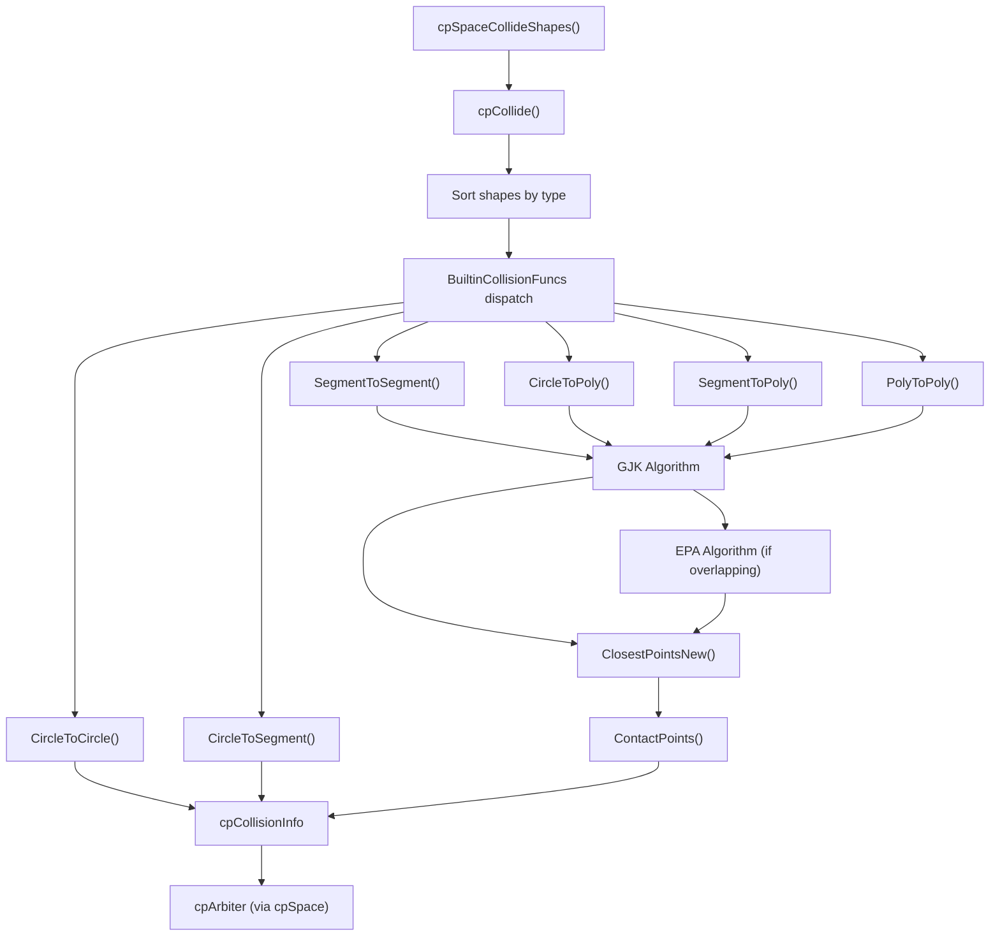

**Sources:** [src/cpCollision.c:701-726]()

## Algorithm Architecture

The collision detection system uses different algorithms depending on shape complexity and collision requirements. Simple shapes use direct geometric calculations, while complex shapes use the GJK/EPA algorithm pair.

### GJK Algorithm Implementation

The GJK algorithm calculates the minimum distance between two convex shapes by iteratively sampling their Minkowski difference. The implementation uses recursive function calls with early termination conditions.

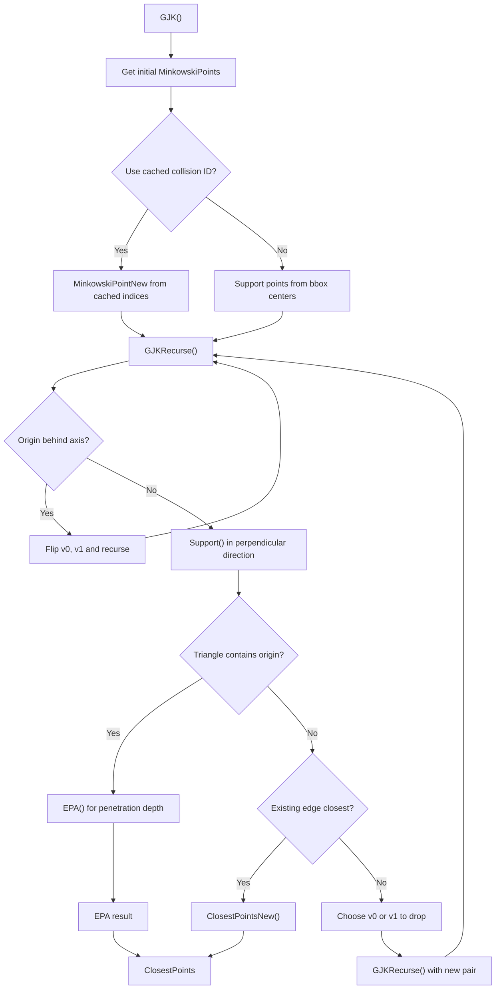

**Sources:** [src/cpCollision.c:415-472](), [src/cpCollision.c:347-392]()

### EPA Algorithm for Penetration Depth

When GJK determines that shapes are overlapping, EPA calculates the exact penetration depth and separation vector by expanding the convex hull of Minkowski difference points.

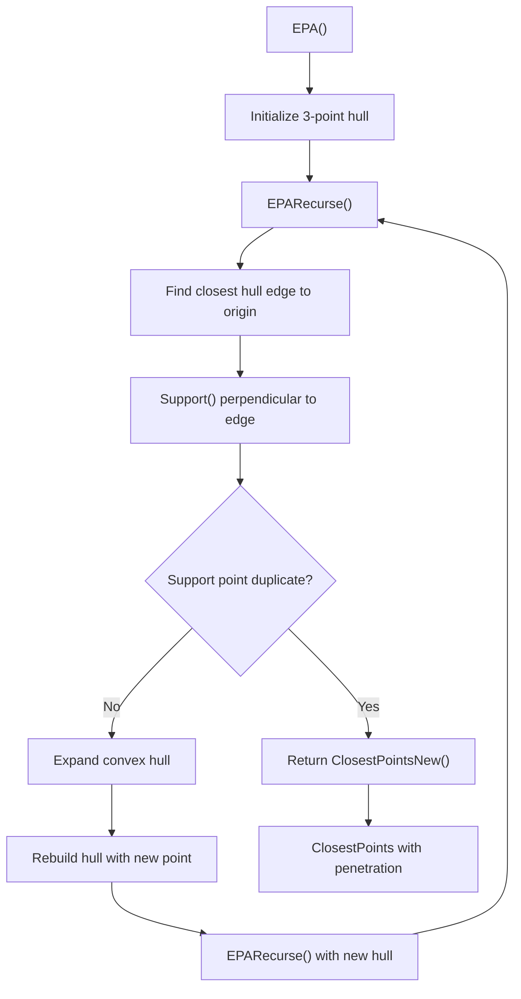

**Sources:** [src/cpCollision.c:334-342](), [src/cpCollision.c:268-332]()

## Shape-Specific Collision Functions

The system provides optimized collision functions for primitive shape pairs that avoid the computational overhead of GJK/EPA when direct geometric calculations are simpler and faster.

| Shape Pair | Function | Algorithm | Complexity |
|------------|----------|-----------|------------|
| Circle-Circle | `CircleToCircle` | Distance comparison | O(1) |
| Circle-Segment | `CircleToSegment` | Point-to-line distance | O(1) |
| Segment-Segment | `SegmentToSegment` | GJK with tangent rejection | O(log n) |
| Circle-Poly | `CircleToPoly` | GJK | O(log n) |
| Segment-Poly | `SegmentToPoly` | GJK with tangent rejection | O(log n) |
| Poly-Poly | `PolyToPoly` | GJK | O(log n) |

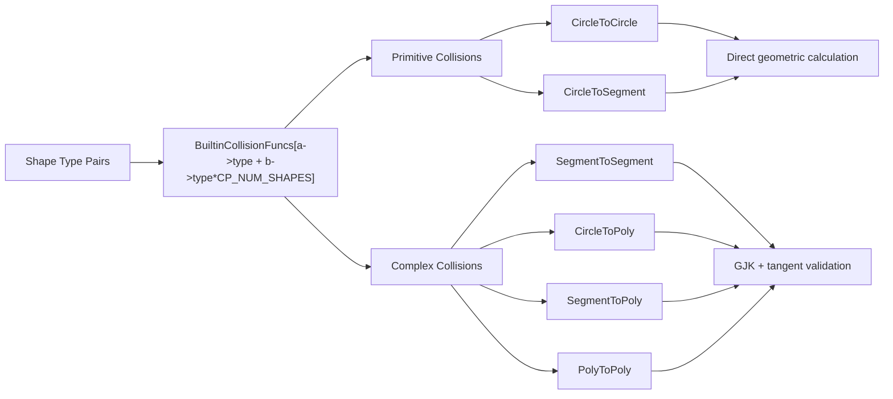

**Sources:** [src/cpCollision.c:688-698](), [src/cpCollision.c:524-679]()

## Support Point System

The support point system provides the foundation for GJK/EPA algorithms by calculating the furthest point on a shape in any given direction. Each shape type implements its own support point function optimized for its geometric properties.

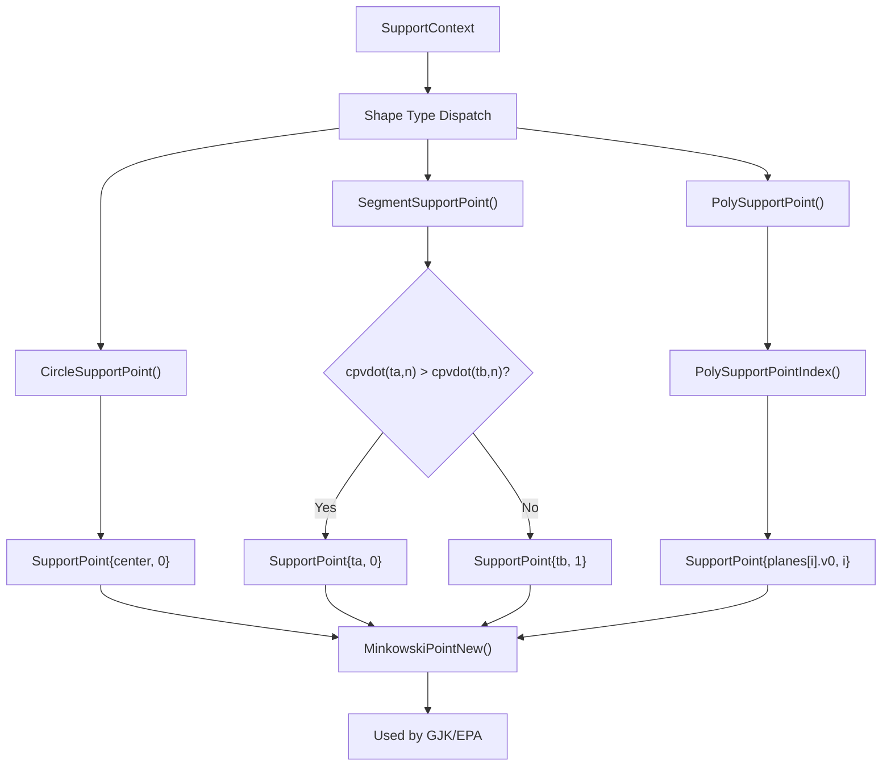

**Sources:** [src/cpCollision.c:93-117](), [src/cpCollision.c:130-148]()

## Contact Generation and Clipping

When shapes are determined to be colliding, the system generates contact points that represent the specific locations and properties of the collision. This involves clipping support edges against each other to find intersection points.

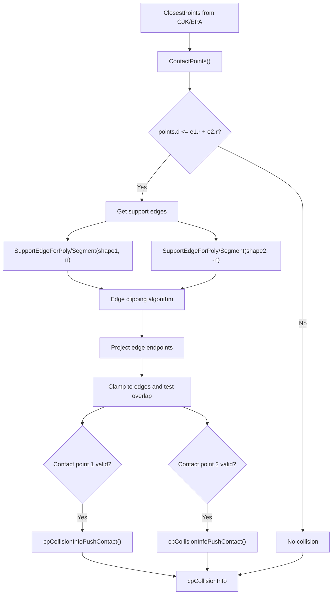

**Sources:** [src/cpCollision.c:476-518](), [src/cpCollision.c:163-195](), [src/cpCollision.c:44-55]()

## Integration with Physics Engine

The collision detection system integrates with the broader physics simulation through the `cpCollisionInfo` structure, which packages collision results for use by the constraint solver and contact management systems.

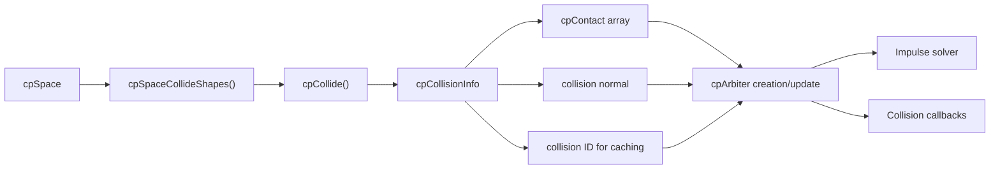

The system maintains collision IDs for temporal coherence, allowing it to reuse previous frame calculations as starting points for GJK, significantly improving performance for persistent contacts.

**Sources:** [src/cpCollision.c:701-726](), [src/cpCollision.c:457-467]()18:T3029,# Rigid Bodies (cpBody)

<details>
<summary>Relevant source files</summary>

The following files were used as context for generating this wiki page:

- [include/chipmunk/cpBody.h](include/chipmunk/cpBody.h)
- [src/cpBody.c](src/cpBody.c)
- [src/cpSpaceComponent.c](src/cpSpaceComponent.c)

</details>


This document covers the `cpBody` system in Chipmunk2D, which represents rigid bodies in the physics simulation. Rigid bodies are the fundamental moving objects that have mass, position, velocity, and other physical properties. For information about collision shapes that define the geometry of bodies, see [Collision Shapes](#2.4). For details about the overall physics simulation pipeline, see [Physics Simulation (cpSpace)](#2.1).

## Body Types

Chipmunk2D supports three distinct body types that determine how a body participates in physics simulation:

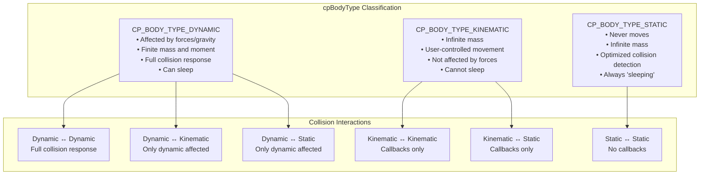

**Sources:** [include/chipmunk/cpBody.h:28-41](), [src/cpBody.c:136-146](), [src/cpBody.c:148-201]()

## Core Properties and State

A `cpBody` maintains several categories of physical state that define its behavior in the simulation:

| Property Category | Fields | Description |
|------------------|--------|-------------|
| **Mass Properties** | `m`, `i`, `m_inv`, `i_inv`, `cog` | Mass, moment of inertia, inverses, center of gravity |
| **Position State** | `p`, `a`, `transform` | Position, angle, transformation matrix |
| **Velocity State** | `v`, `w`, `v_bias`, `w_bias` | Linear/angular velocity, bias velocities for solver |
| **Force Accumulation** | `f`, `t` | Accumulated forces and torques for next integration |
| **Relationships** | `shapeList`, `arbiterList`, `constraintList` | Linked lists of attached objects |
| **Sleeping State** | `sleeping.root`, `sleeping.next`, `sleeping.idleTime` | Component-based sleeping system |

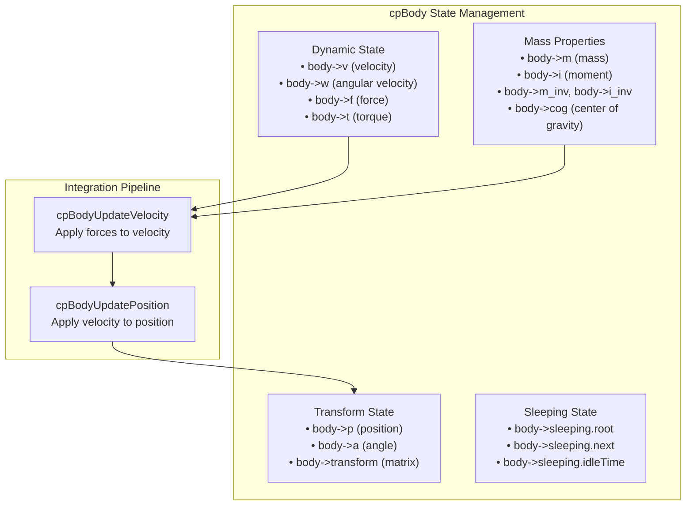

**Sources:** [src/cpBody.c:34-66](), [src/cpBody.c:494-522]()

## Lifecycle Management

Bodies follow a standard allocation, initialization, and destruction pattern:

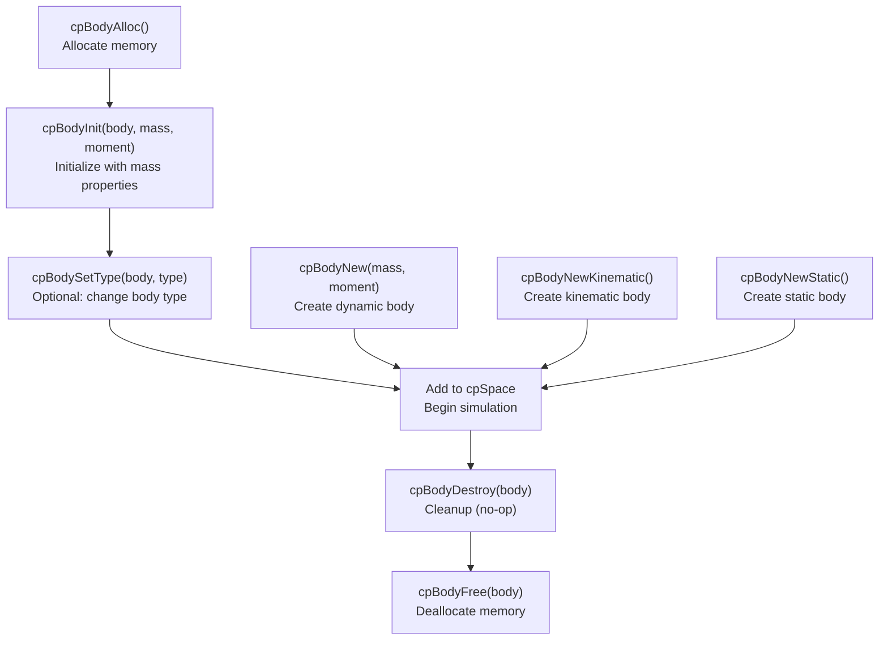

**Sources:** [src/cpBody.c:27-101]()

## Mass Properties

Bodies automatically calculate their mass properties from attached shapes when they are dynamic bodies. This system ensures the center of gravity and moment of inertia remain consistent as shapes are added or removed:

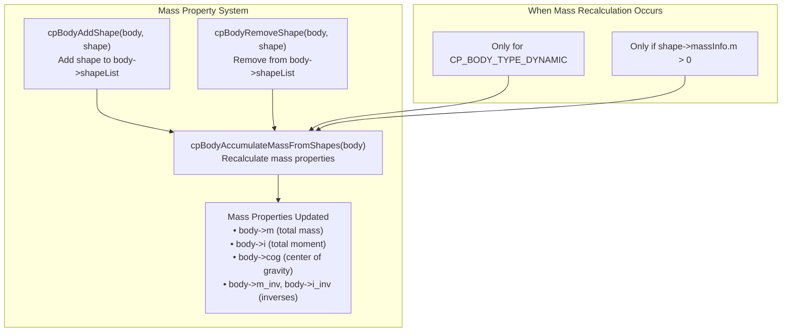

**Sources:** [src/cpBody.c:206-239](), [src/cpBody.c:289-324](), [src/cpBody.c:254-280]()

## Physics Integration

Bodies use a two-phase integration system where velocity is updated first using forces, then position is updated using the new velocity:

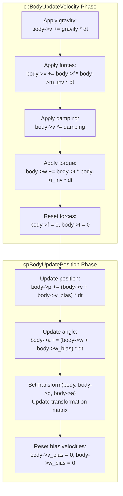

**Sources:** [src/cpBody.c:494-522](), [src/cpBody.c:347-382]()

## Sleeping System

The sleeping system groups connected bodies into components and puts entire components to sleep when their kinetic energy falls below thresholds. This optimization skips physics calculations for stationary objects:

```mermaid
graph TB
    subgraph SleepingComponents["Component-Based Sleeping"]
        Root["Component Root<br/>body->sleeping.root"]
        LinkedList["Linked List<br/>body->sleeping.next"]
        IdleTime["Idle Timer<br/>body->sleeping.idleTime"]
    end
    
    subgraph ComponentDetection["cpSpaceProcessComponents()"]
        FloodFill["FloodFillComponent()<br/>Group connected bodies"]
        EnergyCheck["ComponentActive()<br/>Check kinetic energy"]
        Deactivate["cpSpaceDeactivateBody()<br/>Remove from simulation"]
    end
    
    subgraph WakeSystem["Activation System"]
        Activate["cpBodyActivate(body)<br/>Wake component"]
        ActivateStatic["cpBodyActivateStatic()<br/>Wake touching bodies"]
        SpaceActivate["cpSpaceActivateBody()<br/>Add back to simulation"]
    end
    
    Root --> LinkedList
    LinkedList --> IdleTime
    
    FloodFill --> EnergyCheck
    EnergyCheck --> Deactivate
    
    Activate --> SpaceActivate
    ActivateStatic --> Activate
```

**Sources:** [src/cpSpaceComponent.c:221-307](), [src/cpSpaceComponent.c:120-167](), [src/cpSpaceComponent.c:28-80]()

## Coordinate Transformations

Bodies provide transformation functions between local body coordinates and world coordinates:

| Function | Purpose | Implementation |
|----------|---------|----------------|
| `cpBodyLocalToWorld()` | Convert body-local point to world coordinates | `cpTransformPoint(body->transform, point)` |
| `cpBodyWorldToLocal()` | Convert world point to body-local coordinates | `cpTransformPoint(cpTransformRigidInverse(body->transform), point)` |
| `cpBodyGetPosition()` | Get body position in world coordinates | `cpTransformPoint(body->transform, cpvzero)` |
| `cpBodySetPosition()` | Set body position, updates transform | Updates `body->p` and calls `SetTransform()` |

**Sources:** [src/cpBody.c:525-534](), [src/cpBody.c:368-382](), [src/cpBody.c:347-357]()

## Force and Impulse Application

Bodies support applying forces and impulses at arbitrary points, which automatically generates appropriate torques:

```mermaid
graph LR
    subgraph ForceApplication["Force Application"]
        WorldForce["cpBodyApplyForceAtWorldPoint()<br/>force + point in world coords"]
        LocalForce["cpBodyApplyForceAtLocalPoint()<br/>force + point in body coords"]
        
        ForceCalc["Calculations:<br/>• body->f += force<br/>• r = point - center_of_gravity<br/>• body->t += cross(r, force)"]
    end
    
    subgraph ImpulseApplication["Impulse Application"]  
        WorldImpulse["cpBodyApplyImpulseAtWorldPoint()<br/>impulse + point in world coords"]
        LocalImpulse["cpBodyApplyImpulseAtLocalPoint()<br/>impulse + point in body coords"]
        
        ImpulseCalc["apply_impulse(body, impulse, r)<br/>Immediate velocity change"]
    end
    
    WorldForce --> ForceCalc
    LocalForce --> WorldForce
    
    WorldImpulse --> ImpulseCalc
    LocalImpulse --> WorldImpulse
```

**Sources:** [src/cpBody.c:536-565]()

## Body Relationships

Bodies maintain linked lists of attached shapes, active collision arbiters, and constraints. These relationships are managed automatically by the space:

| Relationship Type | List Field | Iterator Function | Purpose |
|------------------|------------|------------------|---------|
| **Shapes** | `body->shapeList` | `cpBodyEachShape()` | Collision geometry attached to body |
| **Arbiters** | `body->arbiterList` | `cpBodyEachArbiter()` | Active collision contacts |
| **Constraints** | `body->constraintList` | `cpBodyEachConstraint()` | Joints and springs attached to body |

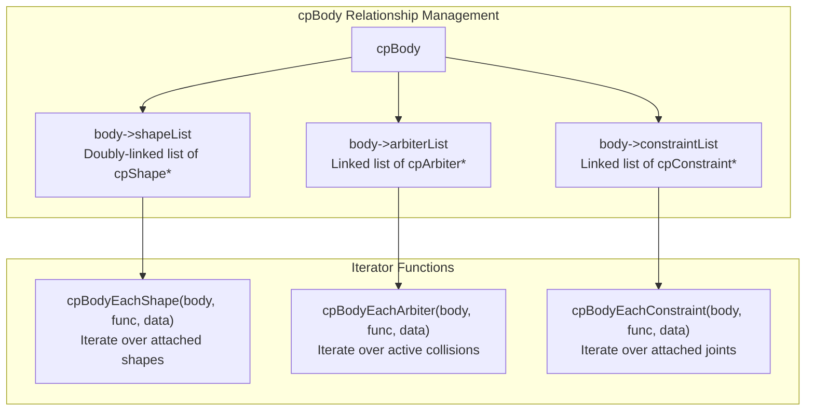

**Sources:** [src/cpBody.c:591-626](), [src/cpBody.c:289-324]()19:T340b

