# Collision Shapes

Relevant source files

The following files were used as context for generating this wiki page:

- [include/chipmunk/cpPolyShape.h](include/chipmunk/cpPolyShape.h)
- [include/chipmunk/cpShape.h](include/chipmunk/cpShape.h)
- [src/cpPolyShape.c](src/cpPolyShape.c)
- [src/cpShape.c](src/cpShape.c)

This document covers the collision geometry system in Chipmunk2D, including the shape type hierarchy, shape properties, spatial queries, and collision filtering. Collision shapes define the geometric boundaries of rigid bodies for collision detection and response.

For information about collision detection algorithms that operate on these shapes, see [Collision Detection System](#2.2). For details about the rigid bodies that shapes attach to, see [Rigid Bodies (cpBody)](#2.3).

## Shape Type Architecture

The collision shape system uses a polymorphic class-based design implemented in C, with three primary shape types that inherit from a common base.

### Shape Class Hierarchy

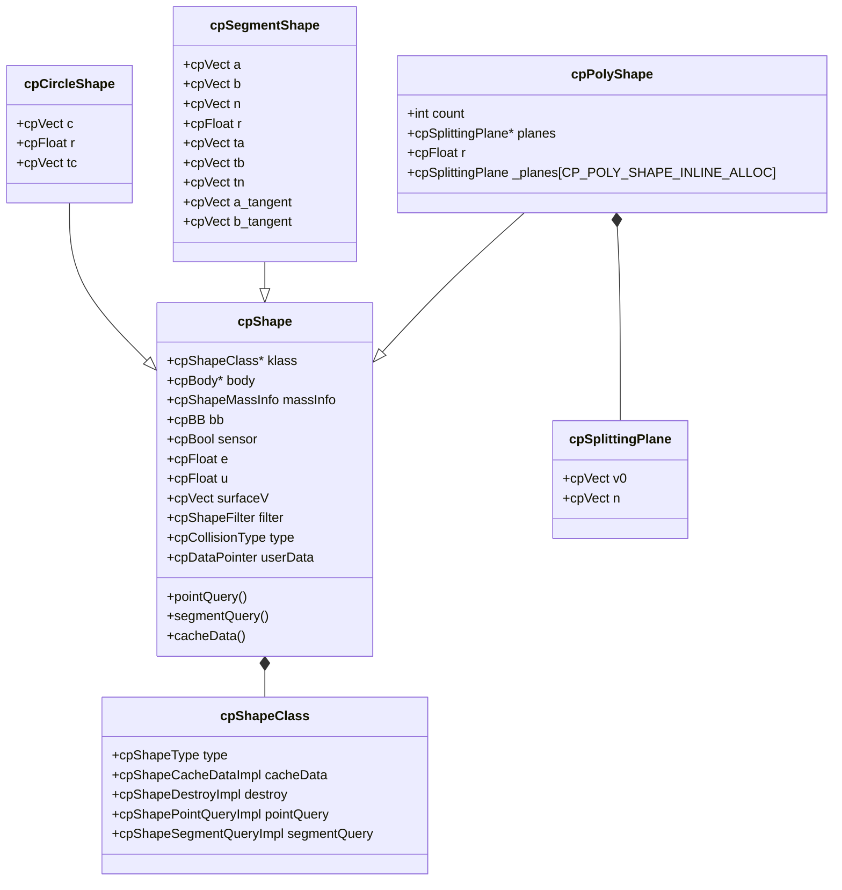

Sources: [src/cpShape.c:31-58](), [include/chipmunk/cpShape.h:22-24](), [src/cpPolyShape.c:25-29]()

### Shape Polymorphism Implementation

Each shape type implements a virtual method table through the `cpShapeClass` structure, enabling type-specific behavior while maintaining a common interface.

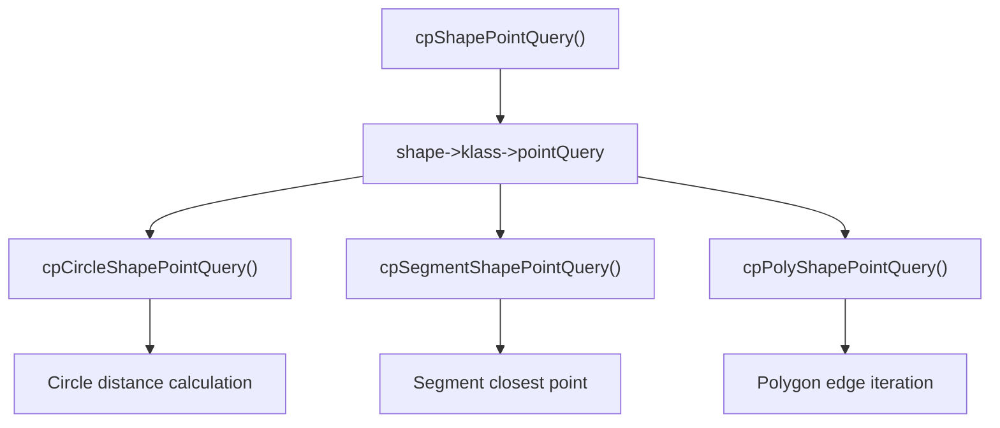

Sources: [src/cpShape.c:222-234](), [src/cpShape.c:332-338](), [src/cpShape.c:479-485](), [src/cpPolyShape.c:182-188]()

## Core Shape Properties

All shapes share a common set of physical and behavioral properties that affect collision detection and response.

### Physical Properties

| Property | Type | Description | Default |
|----------|------|-------------|---------|
| `mass` | `cpFloat` | Mass for inertia calculations | 0.0 |
| `density` | `cpFloat` | Mass per unit area | Calculated |
| `moment` | `cpFloat` | Moment of inertia | Calculated |
| `area` | `cpFloat` | Surface area | Calculated |
| `centerOfGravity` | `cpVect` | Center of mass offset | Calculated |

### Material Properties

| Property | Type | Description | Range |
|----------|------|-------------|-------|
| `elasticity` (e) | `cpFloat` | Restitution coefficient | ≥ 0.0 |
| `friction` (u) | `cpFloat` | Surface friction | ≥ 0.0 |
| `surfaceVelocity` | `cpVect` | Surface conveyor velocity | Any |

### Behavioral Properties

| Property | Type | Description |
|----------|------|-------------|
| `sensor` | `cpBool` | Detects collisions without response |
| `collisionType` | `cpCollisionType` | User-defined collision category |
| `filter` | `cpShapeFilter` | Collision filtering parameters |
| `userData` | `cpDataPointer` | User-defined data pointer |

Sources: [src/cpShape.c:94-110](), [src/cpShape.c:131-170](), [include/chipmunk/cpShape.h:106-159]()

## Shape Types

### Circle Shapes

Circle shapes represent perfect circles with a center offset and radius.

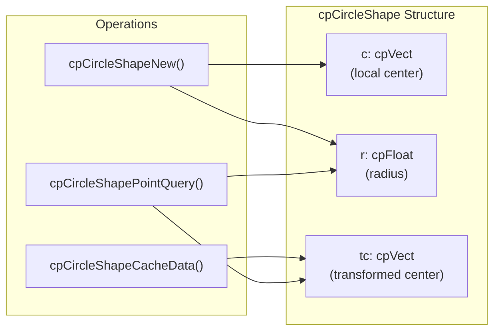

**Key Functions:**
- `cpCircleShapeNew(body, radius, offset)` - Creates a new circle shape
- `cpCircleShapeGetRadius()` / `cpCircleShapeGetOffset()` - Property accessors
- `cpCircleShapeCacheData()` - Updates bounding box and transformed center

Sources: [src/cpShape.c:285-369](), [include/chipmunk/cpShape.h:163-176]()

### Segment Shapes

Segment shapes represent line segments with rounded endpoints, effectively creating capsule-like collision boundaries.

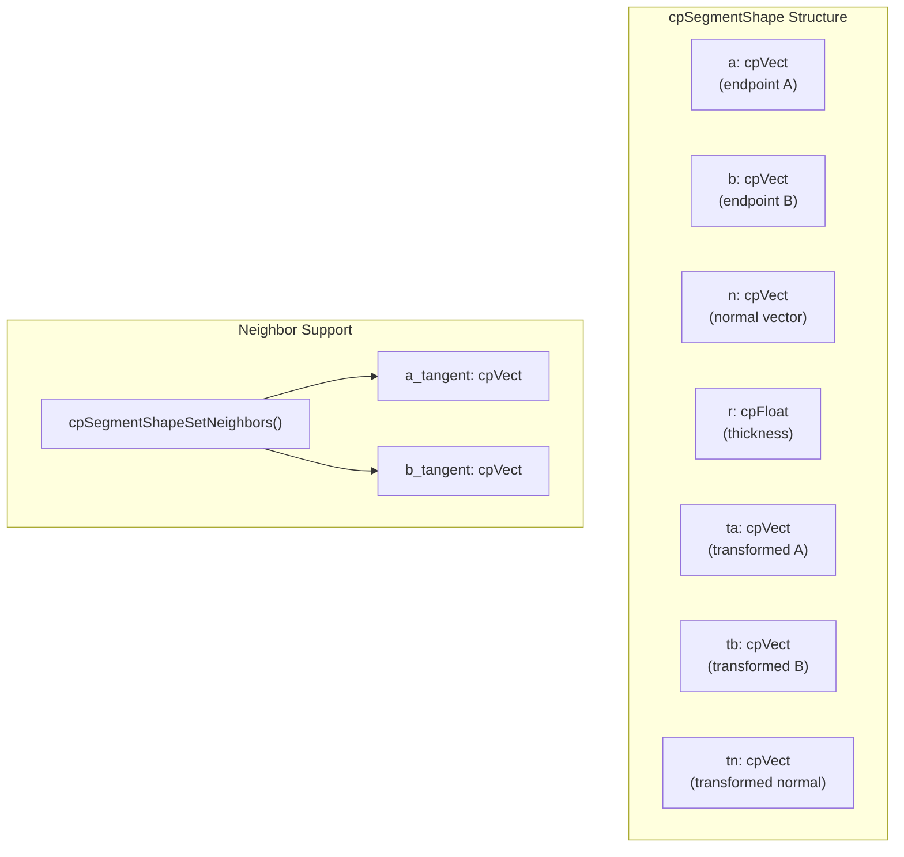

**Neighbor System:** Segments can be linked to adjacent segments to prevent collision artifacts at joints, particularly useful for terrain generation.

Sources: [src/cpShape.c:372-547](), [include/chipmunk/cpShape.h:178-198]()

### Polygon Shapes

Polygon shapes represent convex polygons with optional rounded corners. They use a splitting plane representation for efficient collision detection.

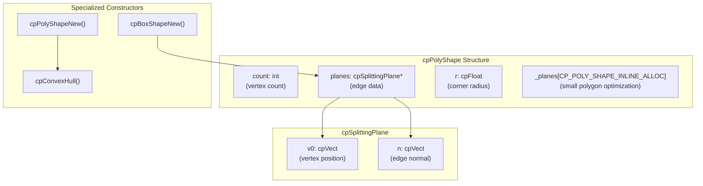

**Memory Optimization:** Small polygons use inline storage (`_planes` array) to avoid heap allocation, while larger polygons dynamically allocate memory.

**Convex Hull:** The `cpPolyShapeNew()` function automatically computes a convex hull from input vertices, while `cpPolyShapeNewRaw()` assumes vertices are already convex.

Sources: [src/cpPolyShape.c:25-257](), [include/chipmunk/cpPolyShape.h:22-56]()

## Spatial Queries

Shapes support two primary spatial query operations for collision detection and game logic.

### Point Queries

Point queries determine the closest point on a shape's surface to a given point and return distance information.

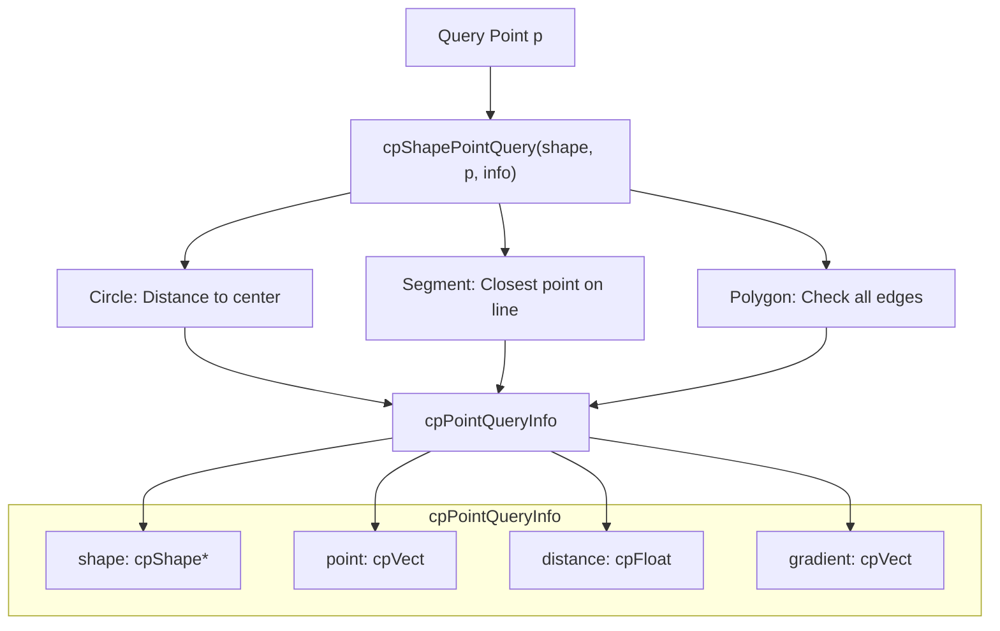

**Distance Semantics:** Negative distances indicate the point is inside the shape, positive distances indicate outside.

Sources: [src/cpShape.c:222-234](), [src/cpShape.c:299-312](), [src/cpShape.c:408-423](), [src/cpPolyShape.c:67-103]()

### Segment Queries

Segment queries perform ray/line casting against shapes to find intersection points.

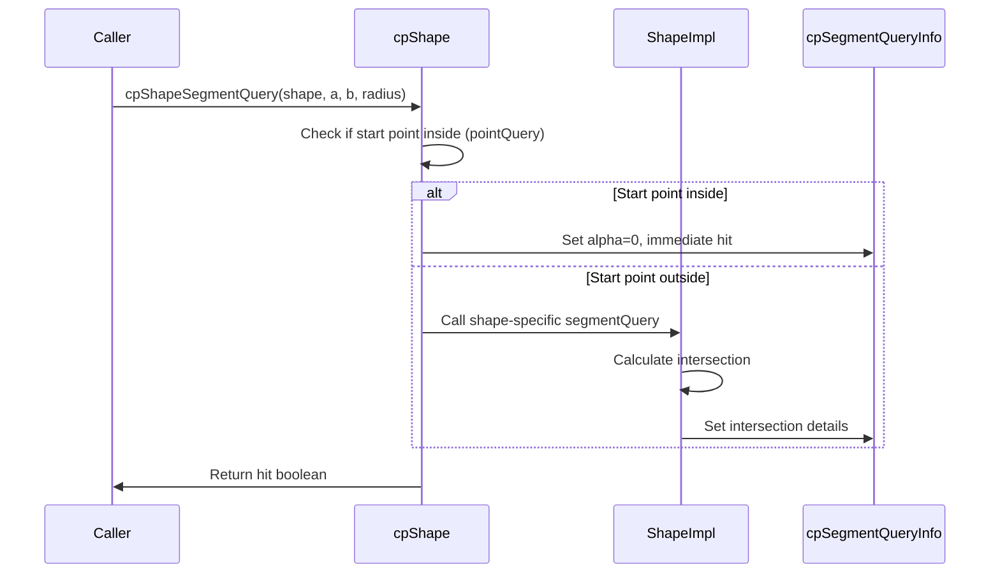

**Segment Query Info:**
- `shape` - The intersected shape (NULL if no hit)
- `point` - The intersection point in world coordinates
- `normal` - The surface normal at intersection
- `alpha` - Normalized distance along segment [0,1]

Sources: [src/cpShape.c:237-257](), [include/chipmunk/cpShape.h:39-49]()

## Shape Filtering and Collision Detection

### Collision Filtering

The `cpShapeFilter` system provides fast collision filtering before expensive collision detection.

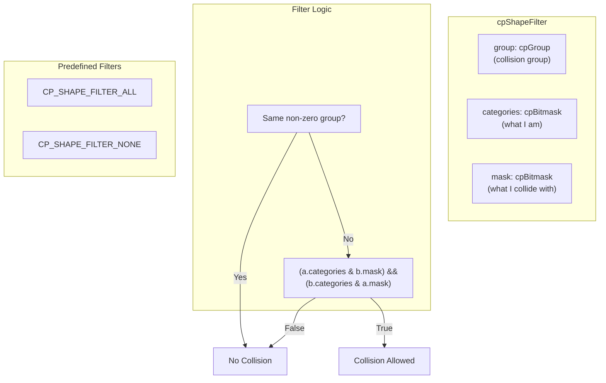

**Group System:** Objects with the same non-zero group value never collide, useful for composite objects.

**Category/Mask System:** Bitwise filtering where both objects must agree to collide:
- `categories` - Defines what collision categories this object belongs to
- `mask` - Defines what categories this object can collide with

Sources: [include/chipmunk/cpShape.h:51-75](), [src/cpShape.c:197-208]()

### Shape-to-Shape Collision

The `cpShapesCollide()` function provides direct collision testing between shapes, bypassing the full physics simulation.

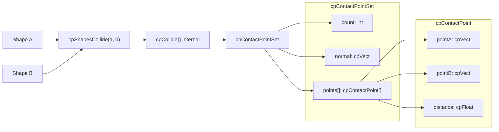

Sources: [src/cpShape.c:259-283](), [include/chipmunk/cpShape.h:94-95]()

## Memory Management and Lifecycle

### Shape Creation Pattern

Chipmunk uses a consistent allocation pattern across all shape types:

1. **Alloc** - `cpXxxShapeAlloc()` allocates memory
2. **Init** - `cpXxxShapeInit()` initializes the structure  
3. **New** - `cpXxxShapeNew()` combines alloc + init

### Bounding Box Caching

Shapes cache their axis-aligned bounding boxes to optimize broad-phase collision detection.

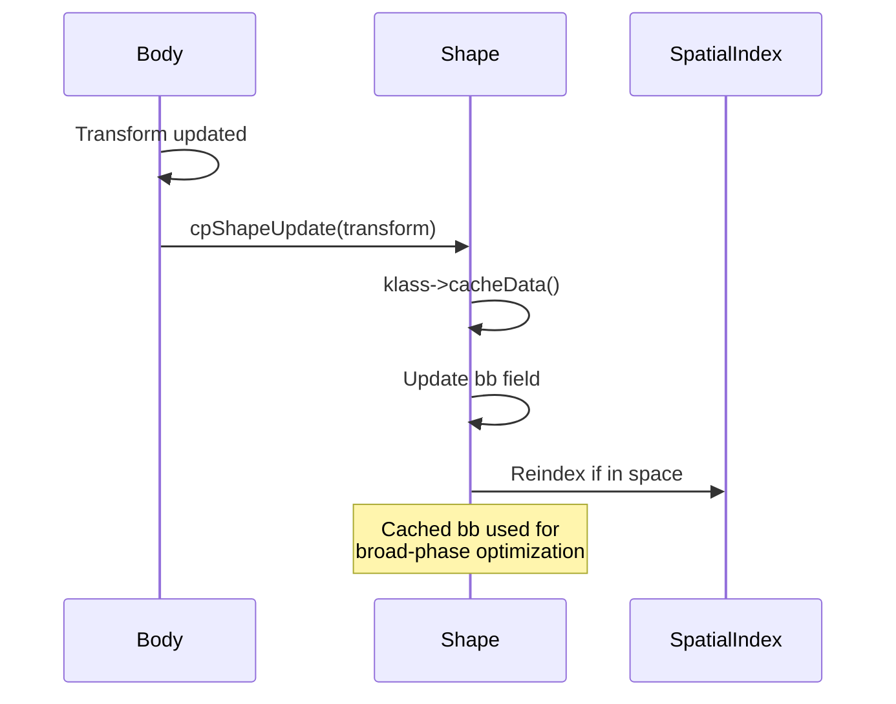

**Cache Lifecycle:**
- Updated when body transform changes
- Used by spatial indexing structures
- Includes shape radius for swept bounds

Sources: [src/cpShape.c:210-220](), [src/cpShape.c:291-296](), [src/cpShape.c:378-405](), [src/cpPolyShape.c:40-64]()1a:T3101,# Spatial Indexing and Optimization

Relevant source files

The following files were used as context for generating this wiki page:

- [include/chipmunk/cpSpatialIndex.h](include/chipmunk/cpSpatialIndex.h)
- [src/cpArray.c](src/cpArray.c)
- [src/cpBBTree.c](src/cpBBTree.c)
- [src/cpHashSet.c](src/cpHashSet.c)
- [src/cpSpaceHash.c](src/cpSpaceHash.c)
- [src/cpSweep1D.c](src/cpSweep1D.c)

## Purpose and Scope

This document covers Chipmunk2D's spatial indexing system, which provides broad-phase collision detection optimizations to accelerate physics simulation performance. The spatial index implementations efficiently determine which objects might potentially collide before performing expensive narrow-phase collision tests.

For information about the narrow-phase collision detection algorithms that follow spatial indexing, see [Collision Detection System](#2.2). For the overall physics simulation pipeline, see [Physics Simulation (cpSpace)](#2.1).

## Overview

Spatial indexing is a critical optimization technique that divides 2D space into regions and tracks which objects occupy each region. This allows the physics engine to quickly eliminate object pairs that are too far apart to possibly collide, reducing collision detection complexity from O(n²) to approximately O(n log n) or better.

### Spatial Index Architecture

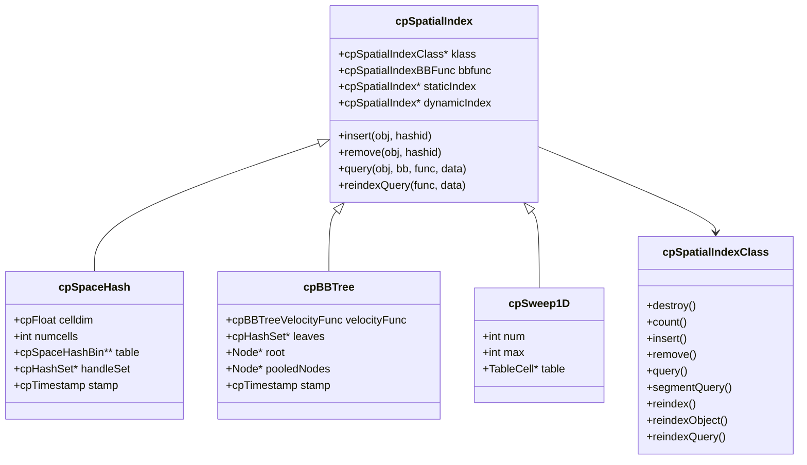

Sources: [include/chipmunk/cpSpatialIndex.h:54-64](), [src/cpSpaceHash.c:28-42](), [src/cpBBTree.c:32-44](), [src/cpSweep1D.c:37-44]()

## Spatial Index Interface

The `cpSpatialIndex` provides a polymorphic interface that all spatial index implementations must support. This allows the physics engine to switch between different spatial indexing strategies transparently.

### Core Operations

| Operation | Purpose | Usage |
|-----------|---------|--------|
| `insert` | Add object to index | Called when objects are created or moved significantly |
| `remove` | Remove object from index | Called when objects are destroyed |
| `query` | Find objects overlapping a bounding box | Used for collision detection and spatial queries |
| `reindexQuery` | Update all object positions and find overlaps | Called each physics step |
| `segmentQuery` | Find objects intersecting a line segment | Used for raycasting |

### Function Pointer Interface

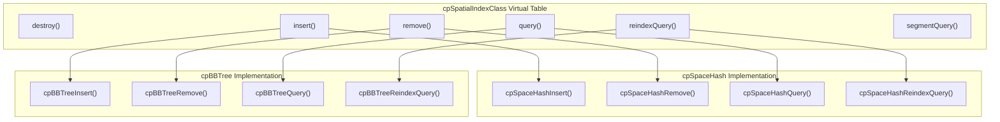

Sources: [include/chipmunk/cpSpatialIndex.h:133-149](), [src/cpSpaceHash.c:573-591](), [src/cpBBTree.c:709-727]()

## Spatial Hash Implementation

The `cpSpaceHash` divides space into a uniform grid of cells, where each cell can contain multiple objects. Objects that span multiple cells are stored in all relevant cells.

### Internal Structure

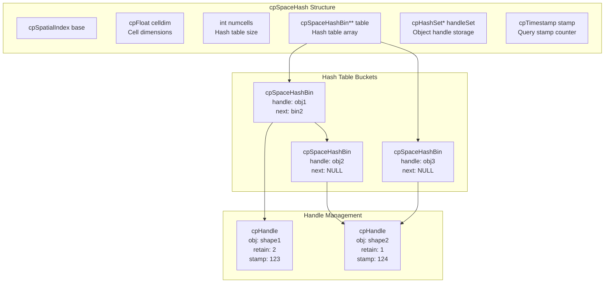

Sources: [src/cpSpaceHash.c:28-42](), [src/cpSpaceHash.c:47-51](), [src/cpSpaceHash.c:96-99]()

### Hash Function and Cell Mapping

The spatial hash uses a simple but effective hash function to map 2D grid coordinates to hash table indices:

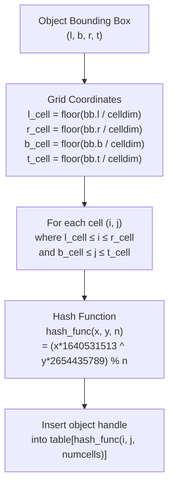

Sources: [src/cpSpaceHash.c:242-268](), [src/cpSpaceHash.c:226-239]()

### Query Process

The spatial hash query process efficiently finds potential collision pairs:

1. **Stamp-based Duplicate Prevention**: Uses timestamps to avoid testing the same pair multiple times
2. **Grid Cell Iteration**: Only checks cells that overlap the query bounding box  
3. **Handle Reference Counting**: Manages object lifetime during queries

Sources: [src/cpSpaceHash.c:376-397](), [src/cpSpaceHash.c:354-374]()

## Bounding Box Tree Implementation

The `cpBBTree` uses a hierarchical tree structure where each internal node contains a bounding box that encompasses all objects in its subtree. This provides logarithmic query performance.

### Tree Structure

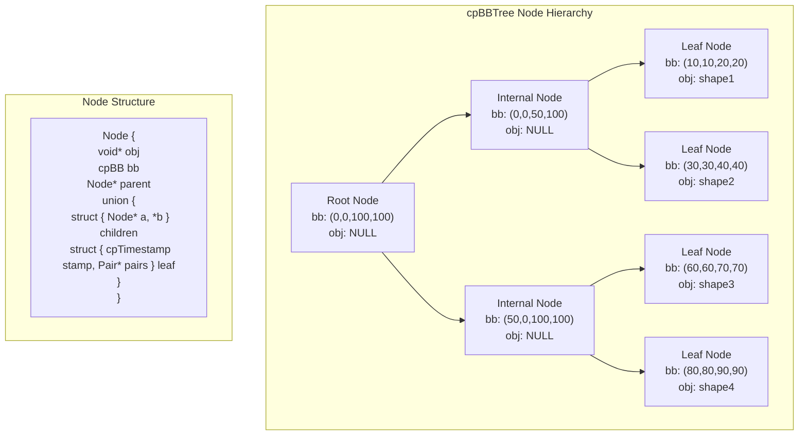

Sources: [src/cpBBTree.c:46-68](), [src/cpBBTree.c:271-284]()

### Tree Operations

The bounding box tree supports efficient insertion, removal, and rebalancing operations:

| Operation | Algorithm | Complexity |
|-----------|-----------|------------|
| Insert | Find best insertion point based on area increase | O(log n) |
| Remove | Remove node and rebalance parent chain | O(log n) |
| Query | Recursively descend tree, pruning non-overlapping subtrees | O(log n + k) |
| Rebalance | Top-down tree reconstruction using median splits | O(n log n) |

### Velocity-Based Prediction

The bounding box tree supports temporal coherence through velocity prediction, expanding bounding boxes based on object velocity to reduce the frequency of tree updates:

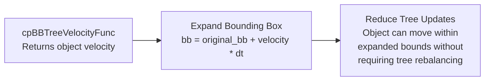

Sources: [src/cpBBTree.c:82-98](), [include/chipmunk/cpSpatialIndex.h:99-102]()

## 1D Sweep Implementation

The `cpSweep1D` implements a simple sweep-and-prune algorithm along a single axis. While less sophisticated than the other implementations, it provides good performance for scenarios with objects distributed primarily along one dimension.

### Structure and Algorithm

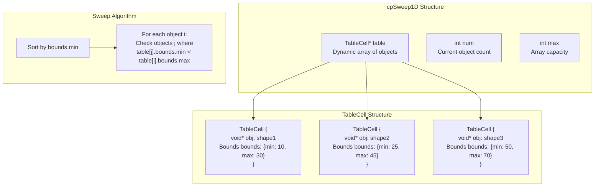

Sources: [src/cpSweep1D.c:32-44](), [src/cpSweep1D.c:205-233]()

## Performance Characteristics

The choice of spatial index depends on the specific characteristics of your simulation:

| Implementation | Best Use Case | Time Complexity | Memory Usage | Notes |
|----------------|---------------|-----------------|--------------|-------|
| `cpSpaceHash` | Uniform object distribution | O(1) average query | Medium | Simple, predictable performance |
| `cpBBTree` | Clustered objects, varying sizes | O(log n) query | Higher | Adaptive, supports velocity prediction |
| `cpSweep1D` | Simple scenes, debug builds | O(n) query | Lowest | Minimal overhead, no acceleration |

### Integration with Collision Detection

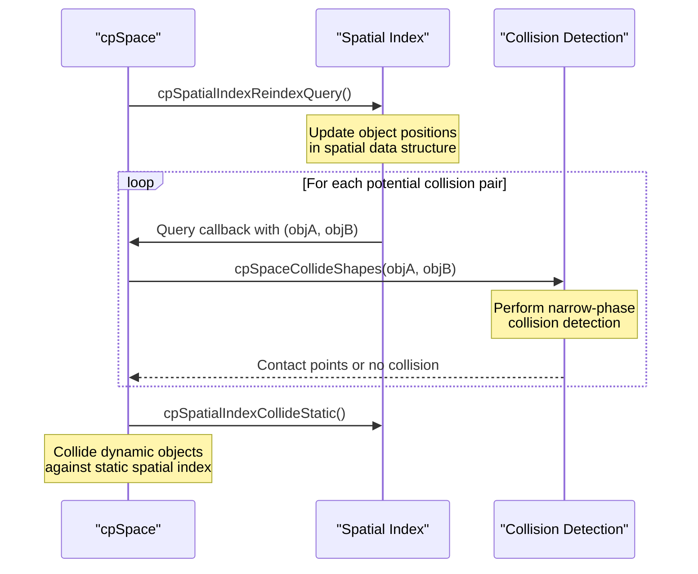

Sources: [src/cpSpaceHash.c:448-457](), [src/cpBBTree.c:639-654]()

The spatial indexing system integrates seamlessly with Chipmunk2D's collision detection pipeline, providing the critical broad-phase optimization that makes real-time physics simulation practical for complex scenes with many objects.

Sources: [src/cpSpaceHash.c](), [src/cpBBTree.c](), [src/cpSweep1D.c](), [include/chipmunk/cpSpatialIndex.h]()1b:T33f7

