# Core Types and Geometry Utilities

<details>
<summary>Relevant source files</summary>

The following files were used as context for generating this wiki page:

- [include/chipmunk/chipmunk_ffi.h](include/chipmunk/chipmunk_ffi.h)
- [include/chipmunk/chipmunk_types.h](include/chipmunk/chipmunk_types.h)
- [include/chipmunk/cpBB.h](include/chipmunk/cpBB.h)
- [include/chipmunk/cpVect.h](include/chipmunk/cpVect.h)

</details>


This page documents Chipmunk2D's foundational mathematical and geometric types that serve as building blocks for all physics operations. These core utilities provide 2D vector mathematics, bounding box operations, coordinate transformations, and basic type definitions that are used throughout the physics engine.

For information about how these types are used in physics simulation, see [Physics Simulation (cpSpace)](#2.1). For details on collision shape implementations that build upon these primitives, see [Collision Shapes](#2.4).

## Basic Types and Configuration

Chipmunk2D provides configurable basic types to support different platforms and precision requirements. The engine can be compiled to use either single or double precision floating point arithmetic.

### Floating Point Configuration

The core floating point type `cpFloat` is configurable at compile time through preprocessor definitions. On Apple platforms, the engine automatically uses Core Graphics types when available for better interoperability.

[include/chipmunk/chipmunk_types.h:64-92]()

Key type definitions:

| Type | Purpose | Default |
|------|---------|---------|
| `cpFloat` | Primary floating point type | `double` |
| `cpBool` | Boolean values | `unsigned char` |
| `cpHashValue` | Hash values for spatial indexing | `uintptr_t` |
| `cpCollisionID` | Collision caching identifiers | `uint32_t` |
| `cpDataPointer` | User data pointers | `void*` |
| `cpCollisionType` | Collision type identifiers | `uintptr_t` |
| `cpGroup` | Shape grouping | `uintptr_t` |
| `cpBitmask` | Layer masks | `unsigned int` |
| `cpTimestamp` | Time tracking | `unsigned int` |

### Floating Point Utility Functions

The engine provides a complete set of floating point utility functions that automatically use the appropriate precision:

[include/chipmunk/chipmunk_types.h:119-160]()

Functions include `cpfmax`, `cpfmin`, `cpfabs`, `cpfclamp`, `cpflerp`, and `cpflerpconst` for common mathematical operations.

**Sources**: [include/chipmunk/chipmunk_types.h:25-268]()

## 2D Vector Mathematics (cpVect)

### Core Vector Type and Operations

The `cpVect` structure represents 2D vectors and points throughout the physics engine. On Apple platforms, it can be aliased to `CGPoint` for seamless integration with Core Graphics.

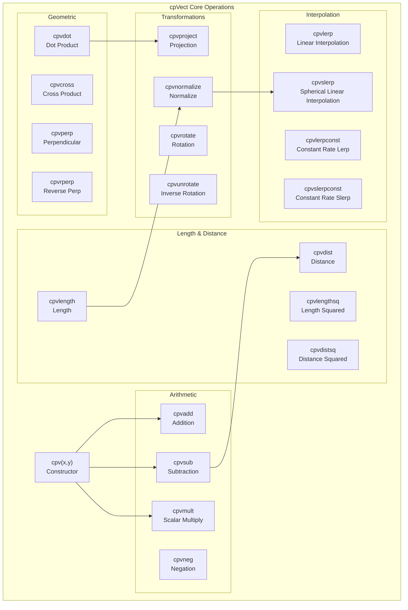

### Essential Vector Operations

The vector library provides comprehensive 2D mathematics:

**Basic Construction and Comparison**:
- `cpv(x, y)` - Create vector from components [include/chipmunk/cpVect.h:35-39]()
- `cpveql(v1, v2)` - Vector equality test [include/chipmunk/cpVect.h:42-45]()

**Arithmetic Operations**:
- `cpvadd(v1, v2)` - Vector addition [include/chipmunk/cpVect.h:48-51]()
- `cpvsub(v1, v2)` - Vector subtraction [include/chipmunk/cpVect.h:54-57]()
- `cpvmult(v, s)` - Scalar multiplication [include/chipmunk/cpVect.h:66-69]()

**Geometric Operations**:
- `cpvdot(v1, v2)` - Dot product for projections [include/chipmunk/cpVect.h:72-75]()
- `cpvcross(v1, v2)` - Cross product magnitude [include/chipmunk/cpVect.h:80-83]()
- `cpvperp(v)` - 90-degree rotation [include/chipmunk/cpVect.h:86-89]()

**Angle and Rotation Operations**:
- `cpvforangle(angle)` - Unit vector from angle [include/chipmunk/cpVect.h:104-107]()
- `cpvtoangle(v)` - Angle from vector [include/chipmunk/cpVect.h:110-113]()
- `cpvrotate(v1, v2)` - Complex number rotation [include/chipmunk/cpVect.h:116-119]()

### Advanced Vector Functions

**Interpolation and Clamping**:
- `cpvlerp(v1, v2, t)` - Linear interpolation [include/chipmunk/cpVect.h:140-143]()
- `cpvslerp(v1, v2, t)` - Spherical linear interpolation [include/chipmunk/cpVect.h:154-166]()
- `cpvclamp(v, len)` - Clamp vector to maximum length [include/chipmunk/cpVect.h:179-182]()

**Sources**: [include/chipmunk/cpVect.h:27-230]()

## Axis-Aligned Bounding Boxes (cpBB)

### Bounding Box Structure and Construction

The `cpBB` type represents axis-aligned bounding boxes used for broad-phase collision detection and spatial queries.

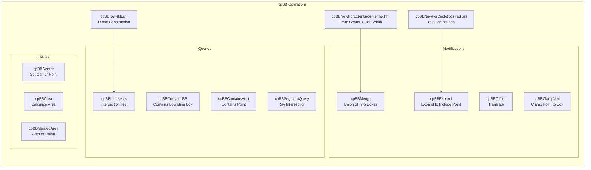

### Core Bounding Box Operations

**Construction Functions**:
- `cpBBNew(l, b, r, t)` - Direct construction from bounds [include/chipmunk/cpBB.h:38-42]()
- `cpBBNewForExtents(center, hw, hh)` - From center and half-dimensions [include/chipmunk/cpBB.h:46-49]()
- `cpBBNewForCircle(pos, radius)` - Bounding box for circle [include/chipmunk/cpBB.h:52-55]()

**Spatial Query Functions**:
- `cpBBIntersects(a, b)` - Intersection test [include/chipmunk/cpBB.h:58-61]()
- `cpBBContainsBB(bb, other)` - Containment test [include/chipmunk/cpBB.h:64-67]()
- `cpBBSegmentQuery(bb, a, b)` - Ray intersection with parametric result [include/chipmunk/cpBB.h:115-143]()

**Modification Operations**:
- `cpBBMerge(a, b)` - Union of two bounding boxes [include/chipmunk/cpBB.h:76-83]()
- `cpBBExpand(bb, v)` - Expand to include point [include/chipmunk/cpBB.h:86-93]()

**Sources**: [include/chipmunk/cpBB.h:33-187]()

## Coordinate Transformations

### Transform Matrices

Chipmunk2D uses column-major affine transforms for coordinate transformations. On Apple platforms, these can use `CGAffineTransform` directly.

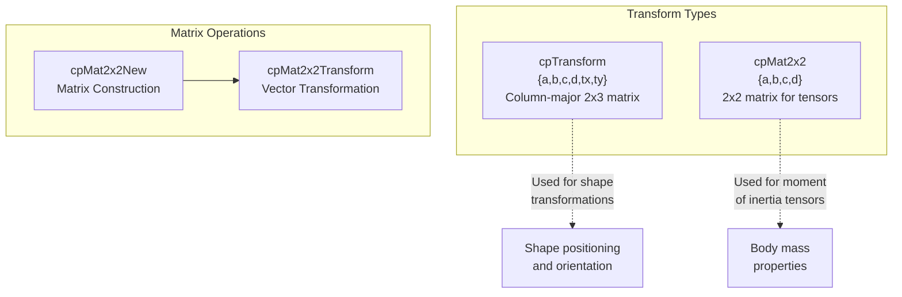

The `cpTransform` structure represents affine transformations using a column-major 2×3 matrix format compatible with graphics libraries [include/chipmunk/chipmunk_types.h:257-260]().

The `cpMat2x2` structure is used internally for 2×2 matrix operations, particularly for moment of inertia tensors [include/chipmunk/chipmunk_types.h:263-266]().

**Matrix Construction and Operations**:
- `cpMat2x2New(a, b, c, d)` - Create 2×2 matrix [include/chipmunk/cpVect.h:216-220]()
- `cpMat2x2Transform(m, v)` - Apply matrix to vector [include/chipmunk/cpVect.h:223-226]()

**Sources**: [include/chipmunk/chipmunk_types.h:254-268](), [include/chipmunk/cpVect.h:215-228]()

## Foreign Function Interface Support

### FFI Function Pointer Generation

The engine provides FFI support for dynamic language bindings through function pointer exports. This allows languages that cannot easily call static inline functions to access the core utilities.

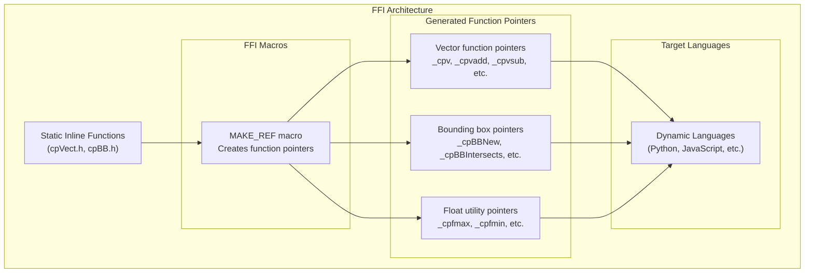

The FFI system creates non-static versions of inline functions for languages that need direct function pointers:

**Vector Function Exports**: [include/chipmunk/chipmunk_ffi.h:42-65]()
**Float Utility Exports**: [include/chipmunk/chipmunk_ffi.h:67-72]()
**Bounding Box Exports**: [include/chipmunk/chipmunk_ffi.h:74-87]()

The `MAKE_REF` macro automatically generates appropriately typed function pointers based on compiler capabilities [include/chipmunk/chipmunk_ffi.h:28-36]().

**Sources**: [include/chipmunk/chipmunk_ffi.h:22-105]()

## Type System Integration

### Core Type Dependencies

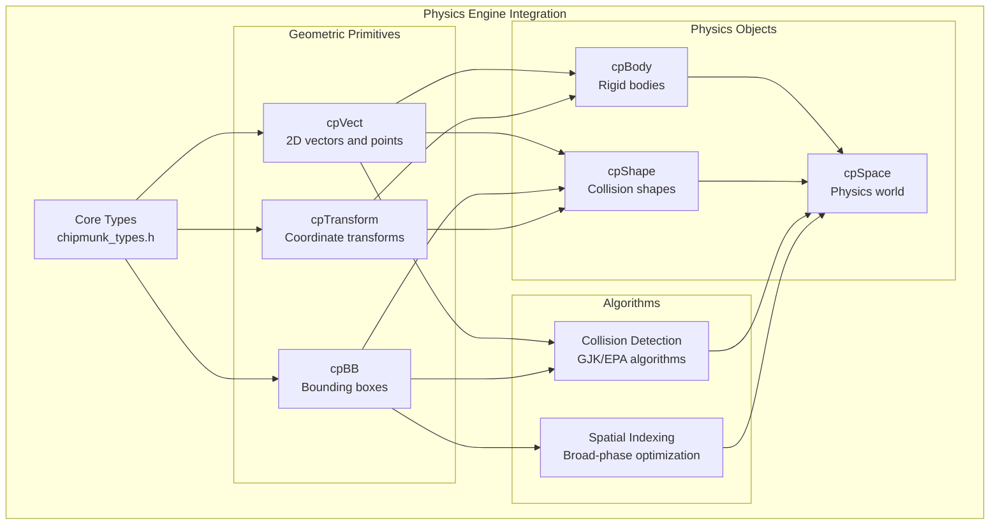

The core types form the foundation of Chipmunk2D's type hierarchy:

- **cpVect** is used for positions, velocities, forces, and normals throughout the engine
- **cpBB** enables efficient broad-phase collision detection and spatial queries  
- **cpTransform** provides coordinate system transformations for shape positioning
- **Basic types** (cpFloat, cpBool, etc.) ensure consistent precision and platform compatibility

These primitives are consumed by higher-level physics objects and algorithms, making them critical for engine performance and correctness.

**Sources**: [include/chipmunk/chipmunk_types.h:25-268](), [include/chipmunk/cpVect.h:27-230](), [include/chipmunk/cpBB.h:33-187]()1c:T2664,# API and Integration

<details>
<summary>Relevant source files</summary>

The following files were used as context for generating this wiki page:

- [TODO.txt](TODO.txt)
- [VERSION.txt](VERSION.txt)
- [doc-src/chipmunk-docs.textile](doc-src/chipmunk-docs.textile)
- [doc/examples.html](doc/examples.html)
- [doc/stylesheet.css](doc/stylesheet.css)
- [include/chipmunk/chipmunk.h](include/chipmunk/chipmunk.h)
- [src/CMakeLists.txt](src/CMakeLists.txt)
- [src/chipmunk.c](src/chipmunk.c)

</details>


This page covers how to integrate Chipmunk2D into applications, including the public API structure, language bindings, memory management patterns, and typical usage workflows. This documentation focuses on the interfaces and integration patterns rather than the internal physics implementation.

For detailed C API reference, see [Public C API](#3.1). For iOS/macOS integration using Objective-C wrappers, see [Objective-C Bindings](#3.2). For information about the core physics systems themselves, see [Core Physics Engine](#2).

## API Architecture Overview

Chipmunk2D provides a layered API architecture designed for easy integration across multiple programming languages and platforms.

### Core API Structure

The main public interface is organized around several key object types that represent different aspects of the physics simulation:

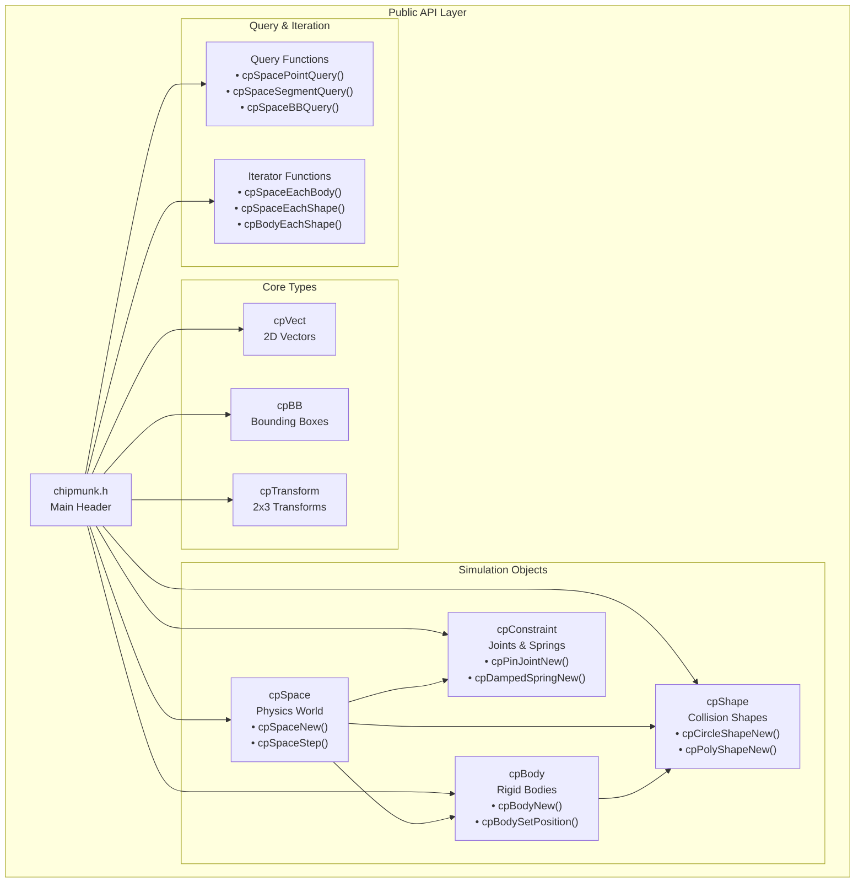

**Sources**: [include/chipmunk/chipmunk.h:22-127](), [include/chipmunk/chipmunk.h:113-126]()

### Language Binding Architecture

Chipmunk2D supports multiple programming languages through various binding mechanisms:

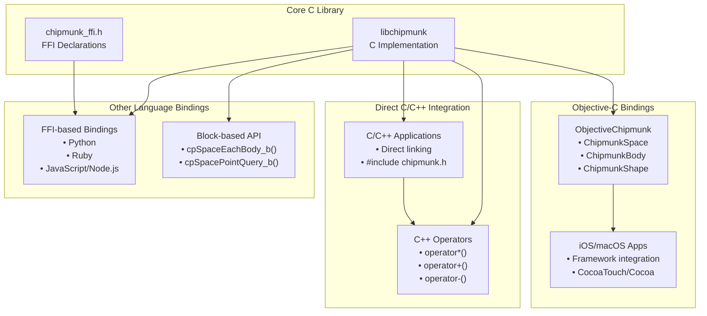

**Sources**: [include/chipmunk/chipmunk.h:44-46](), [include/chipmunk/chipmunk.h:190-217](), [src/chipmunk.c:331]()

## Integration Patterns

### Typical Application Integration Flow

Most applications follow a common pattern when integrating Chipmunk2D:

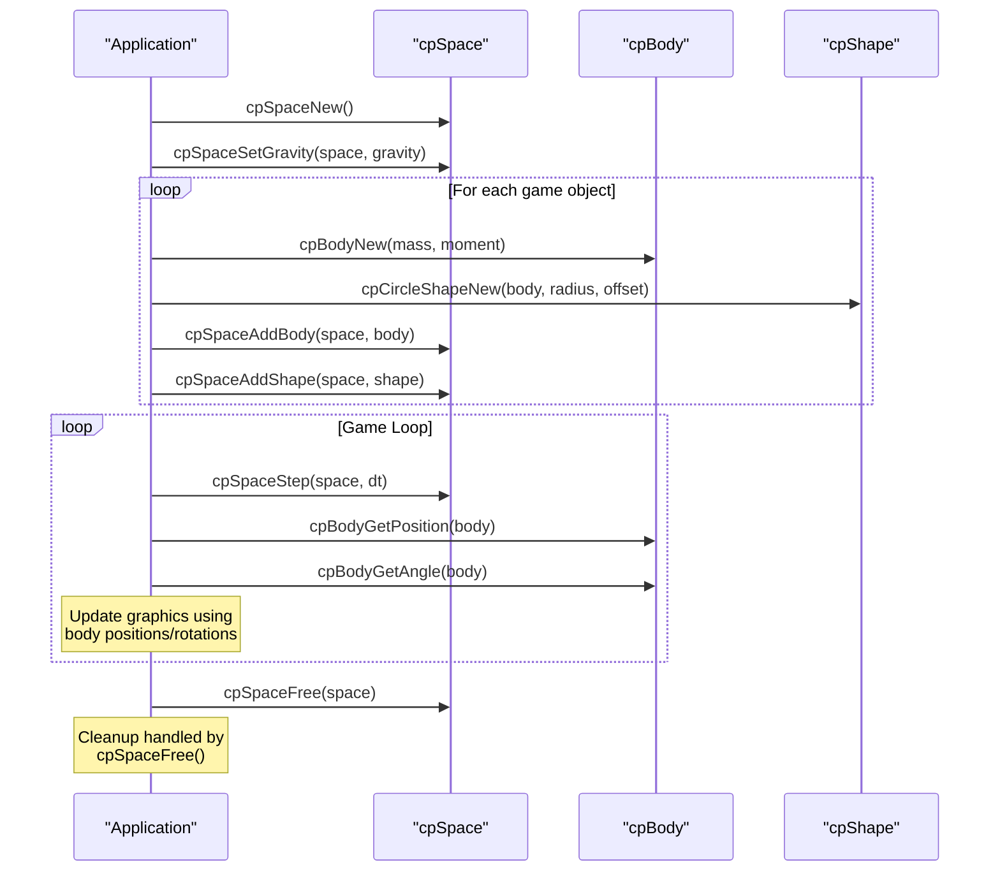

**Sources**: [include/chipmunk/chipmunk.h:88-111](), [doc-src/chipmunk-docs.textile:127-133]()

### Memory Management Model

Chipmunk follows a consistent memory management pattern across all object types:

| Pattern | Functions | Description |
|---------|-----------|-------------|
| **Allocation** | `cpXxxAlloc()` | Allocates uninitialized memory |
| **Initialization** | `cpXxxInit()` | Initializes allocated memory |
| **Creation** | `cpXxxNew()` | Combines allocation + initialization |
| **Cleanup** | `cpXxxDestroy()` | Cleans up internal data |
| **Deallocation** | `cpXxxFree()` | Combines cleanup + deallocation |

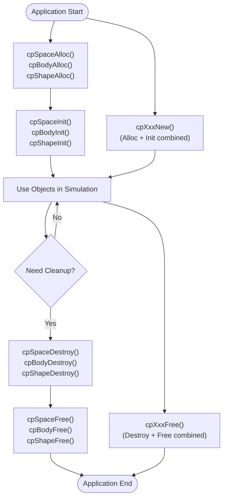

**Sources**: [doc-src/chipmunk-docs.textile:125-142](), [include/chipmunk/chipmunk.h:70-82]()

## Build System Integration

Chipmunk2D supports multiple build systems and platforms:

### CMake Integration

The primary build system uses CMake for cross-platform compilation:

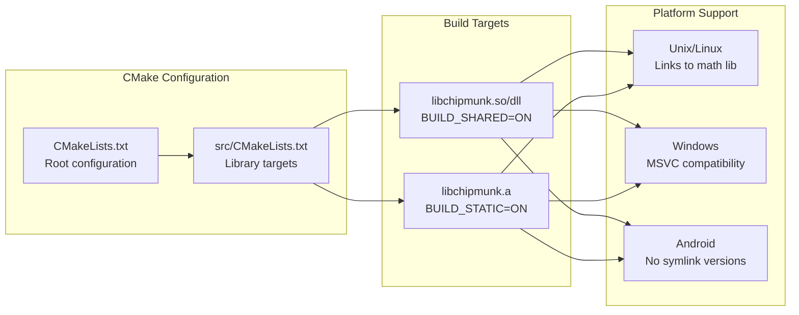

**Sources**: [src/CMakeLists.txt:1-60]()

### Version and Compatibility

The API maintains version compatibility through semantic versioning:

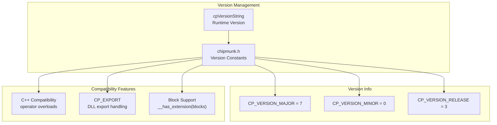

**Sources**: [include/chipmunk/chipmunk.h:128-134](), [src/chipmunk.c:59](), [include/chipmunk/chipmunk.h:38-42]()

## API Design Principles

Chipmunk2D's API follows several key design principles that make integration straightforward:

### Consistent Naming Conventions

- All public functions use `cp` prefix
- Type names use `cpTypeName` pattern
- Functions follow `cpTypeAction` pattern
- Constants use `CP_CONSTANT_NAME` pattern

### Error Handling and Debugging

The API includes comprehensive error checking and debugging support:

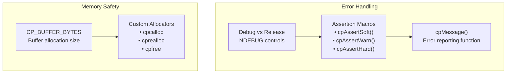

**Sources**: [include/chipmunk/chipmunk.h:48-58](), [include/chipmunk/chipmunk.h:65-83](), [src/chipmunk.c:31-54]()1d:T31fd,# Public C API

<details>
<summary>Relevant source files</summary>

The following files were used as context for generating this wiki page:

- [TODO.txt](TODO.txt)
- [VERSION.txt](VERSION.txt)
- [doc-src/chipmunk-docs.textile](doc-src/chipmunk-docs.textile)
- [doc/examples.html](doc/examples.html)
- [doc/stylesheet.css](doc/stylesheet.css)
- [include/chipmunk/chipmunk.h](include/chipmunk/chipmunk.h)
- [src/CMakeLists.txt](src/CMakeLists.txt)
- [src/chipmunk.c](src/chipmunk.c)

</details>


This page documents the complete public C API provided by Chipmunk2D for application integration. It covers the main header structure, memory management patterns, core data types, and key utility functions that developers use to integrate Chipmunk2D into their C, C++, Objective-C, or Objective-C++ projects.

For language-specific bindings and wrappers, see [Objective-C Bindings (ObjectiveChipmunk)](#3.2). For implementation details of the core physics systems, see [Core Physics Engine](#2).

## API Organization and Header Structure

The Chipmunk2D public API is organized through a single main header file `chipmunk.h` that includes all necessary components. The API is designed to be included in C, C++, Objective-C, and Objective-C++ codebases.

### Header Inclusion Hierarchy

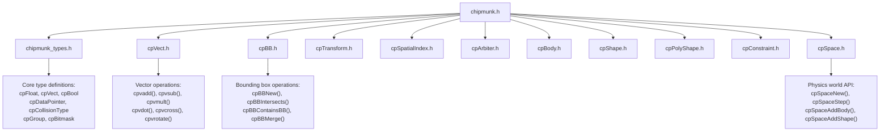

Sources: [include/chipmunk/chipmunk.h:22-127]()

### Platform-Specific Configurations

The API automatically configures itself for different platforms and compilers:

| Platform | Configuration | Details |
|----------|---------------|---------|
| Windows | `CP_EXPORT __declspec(dllexport)` | DLL export declarations |
| iOS | `cpFloat` as `float`, `cpVect` as `CGPoint` | Performance and compatibility |
| Android | Special logging support | Uses `__android_log_print` |
| C++ | Operator overloading | `+`, `-`, `*`, `==` operators for `cpVect` |

Sources: [include/chipmunk/chipmunk.h:38-42](), [include/chipmunk/chipmunk.h:225-231]()

## Memory Management

Chipmunk follows a consistent memory management pattern across all structures. Understanding this pattern is crucial for proper API usage.

### Memory Management Pattern

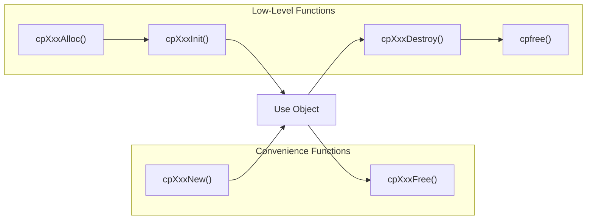

### Memory Management Functions

Every major structure follows this pattern:

```c
// High-level convenience (most common)
cpSpace *cpSpaceNew(void);
void cpSpaceFree(cpSpace *space);

// Low-level control (advanced usage)
cpSpace *cpSpaceAlloc(void);
cpSpace *cpSpaceInit(cpSpace *space);
void cpSpaceDestroy(cpSpace *space);
// Then call cpfree() manually
```

### Memory Management Macros

The API provides customizable memory management through macros that can be overridden at compile time:

| Macro | Default | Purpose |
|-------|---------|---------|
| `cpcalloc` | `calloc` | Allocate zeroed memory |
| `cprealloc` | `realloc` | Reallocate memory |
| `cpfree` | `free` | Free memory |

Sources: [include/chipmunk/chipmunk.h:70-83](), [src/chipmunk.c:31-54]()

## Core Data Types

Chipmunk defines several fundamental types that can be customized at compile time to suit different platforms and requirements.

### Fundamental Types

| Type | Default | Customizable | Purpose |
|------|---------|-------------|---------|
| `cpFloat` | `double` | Yes | Floating-point precision |
| `cpBool` | `int` | Yes | Boolean values |
| `cpDataPointer` | `void*` | Yes | User data pointers |
| `cpCollisionType` | `unsigned int` | Yes | Shape collision types |
| `cpGroup` | `unsigned int` | Yes | Collision groups |
| `cpBitmask` | `unsigned int` | Yes | Collision filter masks |

### Core Structure Types

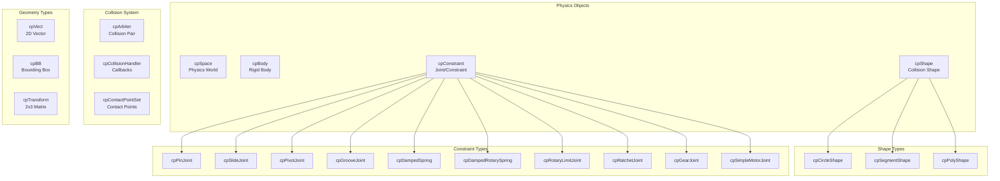

Sources: [include/chipmunk/chipmunk.h:88-111]()

## Error Handling and Debugging

Chipmunk provides a comprehensive assertion and error reporting system designed to help developers catch common mistakes during development.

### Assertion System

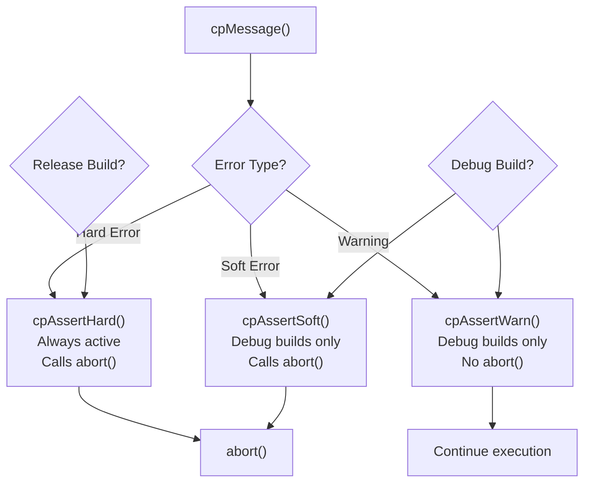

### Assertion Macros

The API provides three levels of assertion checking:

```c
// Hard assertions - always active, program will crash
cpAssertHard(condition, "Fatal error message");

// Soft assertions - debug builds only, program will crash  
cpAssertSoft(condition, "Debug error message");

// Warnings - debug builds only, program continues
cpAssertWarn(condition, "Warning message");
```

### Error Reporting Function

All assertions route through a central error reporting function that provides detailed context:

- **Condition**: The failed assertion condition
- **File and Line**: Source location of the failure
- **Message**: Custom error message with printf-style formatting
- **Platform Support**: Special handling for Android logging

Sources: [include/chipmunk/chipmunk.h:48-58](), [src/chipmunk.c:31-54]()

## Utility Functions

Chipmunk provides numerous utility functions for common physics calculations and geometric operations.

### Moment of Inertia Calculations

| Function | Purpose | Parameters |
|----------|---------|------------|
| `cpMomentForCircle()` | Hollow/solid circle | mass, inner radius, outer radius, offset |
| `cpMomentForSegment()` | Line segment | mass, endpoint A, endpoint B, radius |
| `cpMomentForPoly()` | Polygon | mass, vertex count, vertices, offset, radius |
| `cpMomentForBox()` | Rectangular box | mass, width, height |
| `cpMomentForBox2()` | Box from bounding box | mass, bounding box |

### Area Calculations

| Function | Purpose | Parameters |
|----------|---------|------------|
| `cpAreaForCircle()` | Circle area | inner radius, outer radius |
| `cpAreaForSegment()` | Capsule area | endpoint A, endpoint B, radius |
| `cpAreaForPoly()` | Polygon area | vertex count, vertices, radius |

### Geometric Utilities

```c
// Convex hull generation
int cpConvexHull(int count, const cpVect *verts, cpVect *result, 
                 int *first, cpFloat tol);

// Polygon centroid calculation  
cpVect cpCentroidForPoly(const int count, const cpVect *verts);

// Closest point on line segment
static inline cpVect cpClosetPointOnSegment(const cpVect p, 
                                           const cpVect a, const cpVect b);
```

Sources: [include/chipmunk/chipmunk.h:136-189](), [src/chipmunk.c:63-274]()

## Block-Based API Extensions

For platforms that support Objective-C blocks, Chipmunk provides block-based alternatives to callback-heavy functions.

### Block-Based Iterator Functions

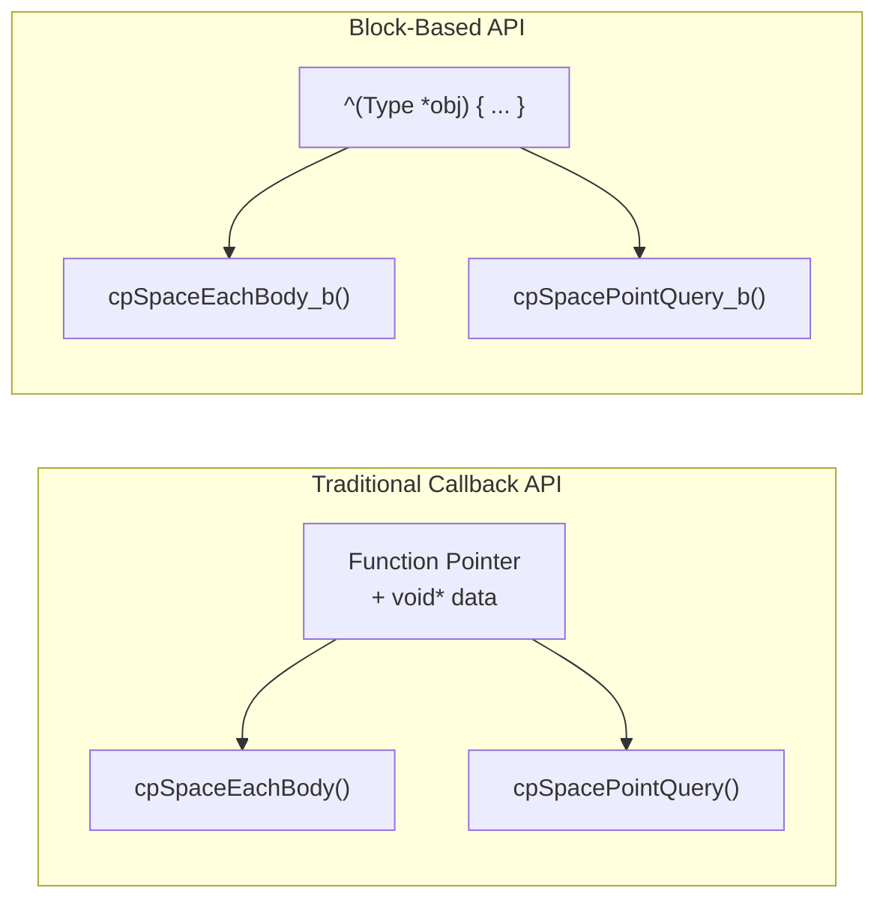

### Available Block-Based Functions

| Category | Functions |
|----------|-----------|
| **Space Iteration** | `cpSpaceEachBody_b()`, `cpSpaceEachShape_b()`, `cpSpaceEachConstraint_b()` |
| **Body Iteration** | `cpBodyEachShape_b()`, `cpBodyEachConstraint_b()`, `cpBodyEachArbiter_b()` |
| **Spatial Queries** | `cpSpacePointQuery_b()`, `cpSpaceSegmentQuery_b()`, `cpSpaceBBQuery_b()`, `cpSpaceShapeQuery_b()` |

Sources: [include/chipmunk/chipmunk.h:190-217](), [src/chipmunk.c:276-329]()

## Version Information and Compatibility

### Version Constants

```c
#define CP_VERSION_MAJOR 7
#define CP_VERSION_MINOR 0  
#define CP_VERSION_RELEASE 3

extern const char *cpVersionString; // "7.0.3"
```

### Language Compatibility

| Language | Support Level | Notes |
|----------|---------------|-------|
| **C** | Full native support | Core implementation language |
| **C++** | Full support + operators | Overloaded `+`, `-`, `*`, `==` for `cpVect` |
| **Objective-C** | Full support | Native integration with iOS/macOS |
| **Objective-C++** | Full support | Best of both worlds |

### Platform Export Macros

```c
#ifdef _WIN32
    #define CP_EXPORT __declspec(dllexport)
#else
    #define CP_EXPORT
#endif
```

Sources: [include/chipmunk/chipmunk.h:128-135](), [src/chipmunk.c:56-59]()

## Usage Patterns

### Basic Integration Pattern

```c
// 1. Create physics space
cpSpace *space = cpSpaceNew();
cpSpaceSetGravity(space, cpv(0, -900));

// 2. Create bodies and shapes
cpBody *body = cpBodyNew(mass, moment);
cpShape *shape = cpCircleShapeNew(body, radius, cpvzero);
cpShapeSetFriction(shape, 0.7);

// 3. Add to space
cpSpaceAddBody(space, body);
cpSpaceAddShape(space, shape);

// 4. Simulation loop
cpSpaceStep(space, dt);

// 5. Cleanup
cpSpaceFree(space); // Automatically frees contained objects
```

### Memory Safety Guidelines

1. **Always match allocation/deallocation calls**
2. **Remove objects from space before freeing them**
3. **Use post-step callbacks for safe removal during simulation**
4. **Don't access objects after freeing them**
5. **Consider using `cpSpaceFree()` to clean up entire simulation**

Sources: [include/chipmunk/chipmunk.h:125-141](), [doc-src/chipmunk-docs.textile:125-143]()1e:T47ba,# Objective-C Bindings (ObjectiveChipmunk)

<details>
<summary>Relevant source files</summary>

The following files were used as context for generating this wiki page:

- [include/chipmunk/cpConstraint.h](include/chipmunk/cpConstraint.h)
- [objectivec/include/ObjectiveChipmunk/ChipmunkConstraint.h](objectivec/include/ObjectiveChipmunk/ChipmunkConstraint.h)
- [objectivec/include/ObjectiveChipmunk/ChipmunkMultiGrab.h](objectivec/include/ObjectiveChipmunk/ChipmunkMultiGrab.h)
- [objectivec/include/ObjectiveChipmunk/ChipmunkShape.h](objectivec/include/ObjectiveChipmunk/ChipmunkShape.h)
- [objectivec/include/ObjectiveChipmunk/ObjectiveChipmunk.h](objectivec/include/ObjectiveChipmunk/ObjectiveChipmunk.h)
- [objectivec/src/ChipmunkConstraint.m](objectivec/src/ChipmunkConstraint.m)
- [objectivec/src/ChipmunkMultiGrab.m](objectivec/src/ChipmunkMultiGrab.m)
- [objectivec/src/ChipmunkShape.m](objectivec/src/ChipmunkShape.m)
- [objectivec/src/ChipmunkSpace.m](objectivec/src/ChipmunkSpace.m)
- [xcode/Chipmunk7.xcodeproj/project.pbxproj](xcode/Chipmunk7.xcodeproj/project.pbxproj)
- [xcode/ObjectiveChipmunkTests/BodyTest.m](xcode/ObjectiveChipmunkTests/BodyTest.m)
- [xcode/ObjectiveChipmunkTests/CallbacksTest.m](xcode/ObjectiveChipmunkTests/CallbacksTest.m)
- [xcode/ObjectiveChipmunkTests/ConvexTest.m](xcode/ObjectiveChipmunkTests/ConvexTest.m)
- [xcode/ObjectiveChipmunkTests/MemoryTest.m](xcode/ObjectiveChipmunkTests/MemoryTest.m)
- [xcode/ObjectiveChipmunkTests/MiscTest.m](xcode/ObjectiveChipmunkTests/MiscTest.m)
- [xcode/ObjectiveChipmunkTests/ShapeTest.m](xcode/ObjectiveChipmunkTests/ShapeTest.m)
- [xcode/ObjectiveChipmunkTests/SpaceTest.m](xcode/ObjectiveChipmunkTests/SpaceTest.m)

</details>


ObjectiveChipmunk provides a full-featured Objective-C wrapper around the core Chipmunk2D physics engine, designed specifically for iOS and macOS applications. It bridges the low-level C physics library with object-oriented Objective-C patterns, automatic memory management, and Apple platform integration.

For information about the underlying C physics engine, see [Core Physics Engine](#2). For platform-specific build configurations, see [Platform-Specific Builds](#6.2).

## Architecture Overview

ObjectiveChipmunk wraps each core Chipmunk2D C type with a corresponding Objective-C class, maintaining a 1:1 relationship between C structs and Objective-C objects while adding memory management and protocol-based composition.

### Core Class Hierarchy

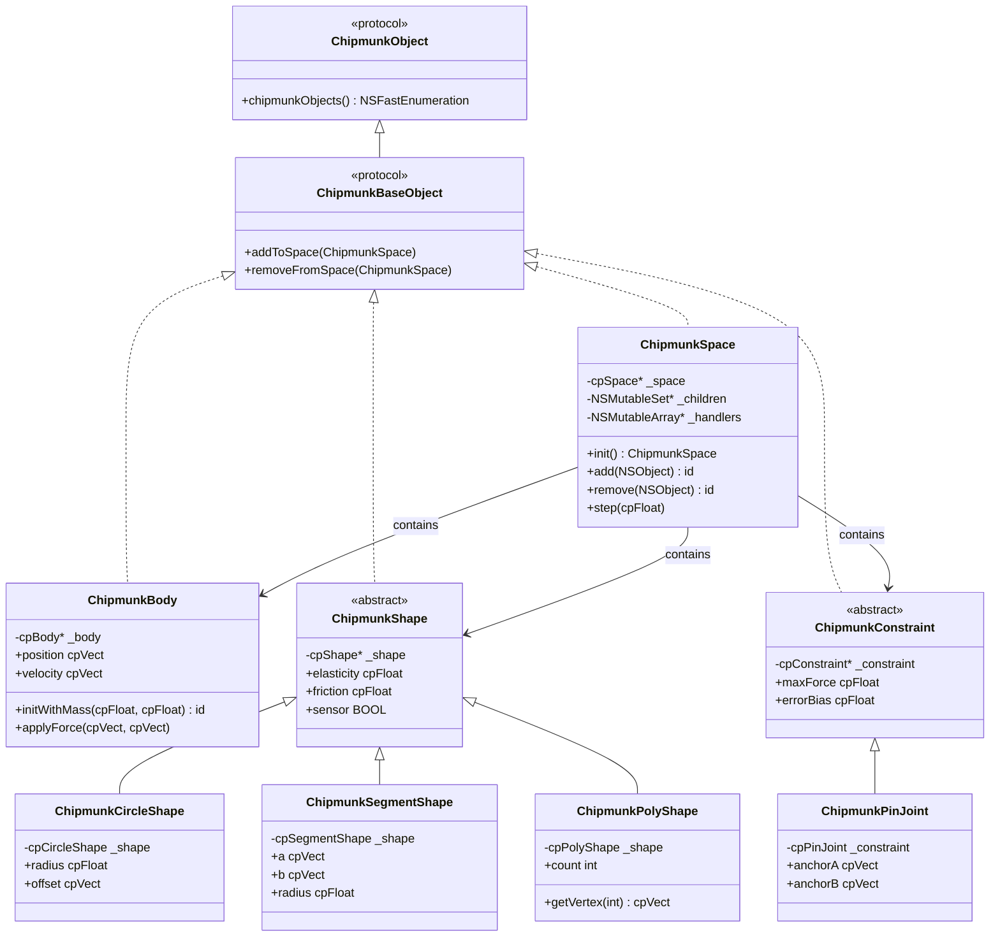

**Sources:** [objectivec/include/ObjectiveChipmunk/ObjectiveChipmunk.h:46-77](), [objectivec/include/ObjectiveChipmunk/ChipmunkShape.h:26-250](), [objectivec/include/ObjectiveChipmunk/ChipmunkConstraint.h:33-96]()

### Memory Management and Object Composition

ObjectiveChipmunk uses a protocol-based system for managing composite physics objects and automatic memory management of underlying C structures.

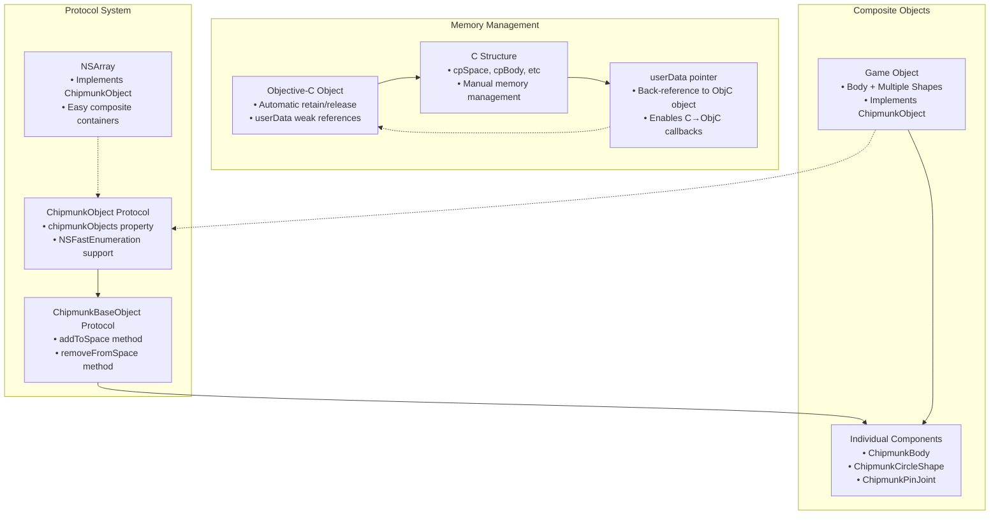

**Sources:** [objectivec/include/ObjectiveChipmunk/ObjectiveChipmunk.h:41-77](), [objectivec/src/ChipmunkSpace.m:31-73]()

## ChipmunkSpace: Physics World Management

`ChipmunkSpace` serves as the primary entry point and manager for the physics simulation, wrapping the C `cpSpace` structure with Objective-C object management and callback handling.

### Core Functionality

| Property/Method | Purpose | C API Mapping |
|-----------------|---------|---------------|
| `space` | Access underlying `cpSpace*` | Direct pointer |
| `gravity` | World gravity vector | `cpSpaceGetGravity/cpSpaceSetGravity` |
| `iterations` | Solver iterations | `cpSpaceGetIterations/cpSpaceSetIterations` |
| `damping` | Global velocity damping | `cpSpaceGetDamping/cpSpaceSetDamping` |
| `step:` | Advance simulation | `cpSpaceStep` |
| `add:` | Add objects to space | Multiple `cpSpaceAdd*` functions |
| `remove:` | Remove objects from space | Multiple `cpSpaceRemove*` functions |

### Collision Handler Integration

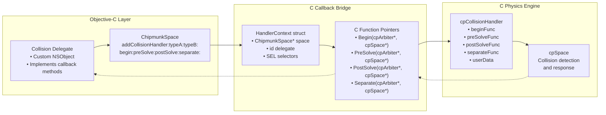

**Sources:** [objectivec/src/ChipmunkSpace.m:84-232](), [objectivec/src/ChipmunkSpace.m:180-191]()

### Post-Step Callbacks and Thread Safety

ObjectiveChipmunk provides thread-safe deferred operations through post-step callbacks, essential for modifying the physics world during collision callbacks.

```mermaid
sequenceDiagram
    participant App as "Application Code"
    participant Space as "ChipmunkSpace"
    participant Callback as "Collision Callback"
    participant PostStep as "Post-Step System"
    
    App->>Space: step(dt)
    Space->>Space: cpSpaceLock()
    Note over Space: Space is locked during simulation
    
    Space->>Callback: Collision detected
    Callback->>Space: smartRemove(object)
    Space->>PostStep: addPostStepRemoval(object)
    Note over PostStep: Deferred until space unlocks
    
    Callback-->>Space: Return from callback
    Space->>Space: cpSpaceUnlock()
    Space->>PostStep: Execute deferred operations
    PostStep->>Space: remove(object)
    
    Space-->>App: Step complete
```

**Sources:** [objectivec/src/ChipmunkSpace.m:266-349](), [objectivec/src/ChipmunkSpace.m:288-349]()

## Shape Wrappers and Collision Detection

ObjectiveChipmunk provides concrete implementations for all Chipmunk2D shape types, each maintaining their C counterpart while adding Objective-C property access and query methods.

### Shape Type Implementation

```mermaid
graph TB
    subgraph "Abstract Base"
        ChipmunkShape["ChipmunkShape<br/>• Abstract base class<br/>• Common properties<br/>• Query methods"]
    end
    
    subgraph "Concrete Implementations"
        CircleShape["ChipmunkCircleShape<br/>• cpCircleShape _shape<br/>• radius property<br/>• offset property"]
        SegmentShape["ChipmunkSegmentShape<br/>• cpSegmentShape _shape<br/>• a, b endpoints<br/>• radius property"]
        PolyShape["ChipmunkPolyShape<br/>• cpPolyShape _shape<br/>• vertex access<br/>• count property"]
    end
    
    subgraph "C Structure Storage"
        CCircle["cpCircleShape<br/>Embedded struct"]
        CSegment["cpSegmentShape<br/>Embedded struct"] 
        CPoly["cpPolyShape<br/>Embedded struct"]
    end
    
    ChipmunkShape --> CircleShape
    ChipmunkShape --> SegmentShape
    ChipmunkShape --> PolyShape
    
    CircleShape --> CCircle
    SegmentShape --> CSegment
    PolyShape --> CPoly
```

### Query System Integration

| Query Type | Objective-C Method | Return Type | C API Equivalent |
|------------|-------------------|-------------|------------------|
| Point Query | `pointQueryAll:maxDistance:filter:` | `NSArray<ChipmunkPointQueryInfo*>` | `cpSpacePointQuery_b` |
| Segment Query | `segmentQueryAllFrom:to:radius:filter:` | `NSArray<ChipmunkSegmentQueryInfo*>` | `cpSpaceSegmentQuery_b` |
| Shape Query | `shapeQueryAll:` | `NSArray<ChipmunkShapeQueryInfo*>` | `cpSpaceShapeQuery_b` |
| BB Query | `bbQueryAll:filter:` | `NSArray<ChipmunkShape*>` | `cpSpaceBBQuery_b` |

**Sources:** [objectivec/src/ChipmunkSpace.m:351-430](), [objectivec/include/ObjectiveChipmunk/ChipmunkShape.h:87-156]()

## Body and Constraint Management

ObjectiveChipmunk wraps rigid body physics and constraint systems with automatic memory management and integration callbacks.

### ChipmunkBody Integration

```mermaid
graph LR
    subgraph "Objective-C Body"
        ChipmunkBody["ChipmunkBody<br/>• cpBody* _body<br/>• NSObject lifecycle<br/>• Property access"]
        Properties["Properties<br/>• position, velocity<br/>• mass, moment<br/>• force, torque"]
        Methods["Methods<br/>• applyForce:atWorldPoint:<br/>• applyImpulse:atWorldPoint:<br/>• sleep, activate"]
    end
    
    subgraph "Custom Integration"
        VelocityUpdate["updateVelocity:gravity:damping:<br/>• Override for custom physics<br/>• Called during cpSpaceStep"]
        PositionUpdate["updatePosition:<br/>• Override for custom movement<br/>• Called during cpSpaceStep"]
        Callbacks["C Function Pointers<br/>• velocity_func<br/>• position_func"]
    end
    
    subgraph "C Physics Body"
        cpBody["cpBody<br/>• Core physics state<br/>• Integration functions<br/>• Space membership"]
    end
    
    ChipmunkBody --> Properties
    ChipmunkBody --> Methods
    ChipmunkBody --> VelocityUpdate
    ChipmunkBody --> PositionUpdate
    VelocityUpdate --> Callbacks
    PositionUpdate --> Callbacks
    Callbacks --> cpBody
    ChipmunkBody --> cpBody
```

**Sources:** [xcode/ObjectiveChipmunkTests/BodyTest.m:26-46](), [xcode/ObjectiveChipmunkTests/BodyTest.m:121-133]()

### Constraint System Architecture

ObjectiveChipmunk provides Objective-C wrappers for all joint and constraint types, with embedded C structures and callback integration.

| Constraint Type | Objective-C Class | C Structure | Purpose |
|-----------------|-------------------|-------------|---------|
| Pin Joint | `ChipmunkPinJoint` | `cpPinJoint` | Fixed distance connection |
| Slide Joint | `ChipmunkSlideJoint` | `cpSlideJoint` | Variable distance range |
| Pivot Joint | `ChipmunkPivotJoint` | `cpPivotJoint` | Rotation point |
| Groove Joint | `ChipmunkGrooveJoint` | `cpGrooveJoint` | Sliding track |
| Damped Spring | `ChipmunkDampedSpring` | `cpDampedSpring` | Spring with damping |
| Damped Rotary Spring | `ChipmunkDampedRotarySpring` | `cpDampedRotarySpring` | Rotational spring |
| Simple Motor | `ChipmunkSimpleMotor` | `cpSimpleMotor` | Constant rotation |

**Sources:** [objectivec/src/ChipmunkConstraint.m:156-481](), [objectivec/include/ObjectiveChipmunk/ChipmunkConstraint.h:99-383]()

## Multi-Touch and Interactive Features

ObjectiveChipmunk includes specialized classes for handling multi-touch interaction with physics objects, particularly useful for iOS applications.

### ChipmunkMultiGrab System

```mermaid
graph TB
    subgraph "Touch Interface"
        MultiTouch["Multi-Touch Events<br/>• beginLocation:<br/>• updateLocation:<br/>• endLocation:"]
        MultiGrab["ChipmunkMultiGrab<br/>• Manages multiple grabs<br/>• Filtering and sorting<br/>• Push/pull modes"]
    end
    
    subgraph "Individual Grab"
        Grab["ChipmunkGrab<br/>• Single touch point<br/>• Constraint-based<br/>• Smoothing applied"]
        GrabBody["Kinematic Grab Body<br/>• Follows touch position<br/>• No gravity/forces"]
        Constraints["Grab Constraints<br/>• ChipmunkPivotJoint<br/>• Friction joints<br/>• Gear joints (rotation)"]
    end
    
    subgraph "Physics Integration"
        TargetBody["Target ChipmunkBody<br/>• Grabbed physics object<br/>• Normal simulation"]
        TargetShape["ChipmunkShape<br/>• Collision shape<br/>• Selection target"]
    end
    
    MultiTouch --> MultiGrab
    MultiGrab --> Grab
    Grab --> GrabBody
    Grab --> Constraints
    Constraints --> TargetBody
    TargetBody --> TargetShape
    
    MultiGrab -.-> |"Filter/Sort"| TargetShape
```

**Sources:** [objectivec/src/ChipmunkMultiGrab.m:56-100](), [objectivec/include/ObjectiveChipmunk/ChipmunkMultiGrab.h:47-136]()

## Platform Integration and Build System

ObjectiveChipmunk integrates tightly with Apple's development ecosystem through Xcode projects and platform-specific optimizations.

### Build Configuration Matrix

| Target | Platform | Library Output | Key Features |
|--------|----------|----------------|--------------|
| `libChipmunk-iOS.a` | iOS | Static Library | Core C library |
| `libObjectiveChipmunk-iOS.a` | iOS | Static Library | Objective-C wrapper |
| `libChipmunk-Mac.a` | macOS | Static Library | Desktop version |
| `ObjectiveChipmunk-Mac` | macOS | Static Library | Desktop wrapper |
| `libChipmunk-tvOS.a` | tvOS | Static Library | Apple TV support |

### Memory Management Patterns

ObjectiveChipmunk uses manual reference counting (non-ARC) with careful attention to C↔Objective-C object lifecycle management:

```mermaid
graph LR
    subgraph "Object Creation"
        ObjCInit["Objective-C init<br/>• Allocate C structure<br/>• Set userData pointer<br/>• Retain dependencies"]
        CInit["C Structure Init<br/>• cpBodyInit<br/>• cpShapeInit<br/>• cpConstraintInit"]
    end
    
    subgraph "Lifecycle Management"
        AddToSpace["Add to Space<br/>• Space retains object<br/>• C structure added<br/>• Callbacks registered"]
        InUse["Active Use<br/>• Property access<br/>• Method calls<br/>• Automatic updates"]
        RemoveFromSpace["Remove from Space<br/>• Space releases object<br/>• C structure removed<br/>• Cleanup callbacks"]
    end
    
    subgraph "Cleanup"
        ObjCDealloc["Objective-C dealloc<br/>• Release dependencies<br/>• Clear userData<br/>• Call C destructor"]
        CDestroy["C Structure Cleanup<br/>• cpBodyDestroy<br/>• cpShapeDestroy<br/>• Memory freed"]
    end
    
    ObjCInit --> CInit
    CInit --> AddToSpace
    AddToSpace --> InUse
    InUse --> RemoveFromSpace
    RemoveFromSpace --> ObjCDealloc
    ObjCDealloc --> CDestroy
```

**Sources:** [xcode/ObjectiveChipmunkTests/MemoryTest.m:34-93](), [objectivec/src/ChipmunkSpace.m:116-150]()

## Testing and Quality Assurance

ObjectiveChipmunk includes comprehensive test suites covering memory management, collision callbacks, and platform-specific behaviors.

### Test Coverage Areas

| Test Class | Focus Area | Key Tests |
|------------|------------|-----------|
| `SpaceTest` | Physics world management | Property access, queries, simulation |
| `BodyTest` | Rigid body physics | Integration, callbacks, sleeping |
| `ShapeTest` | Collision shapes | Properties, queries, space membership |
| `MemoryTest` | Reference counting | Retain/release cycles, cleanup |
| `CallbacksTest` | Collision handling | Handler registration, callback execution |
| `ConvexTest` | Geometry algorithms | Convex hull, polygon validation |
| `MiscTest` | Utility functions | Vector math, bounding boxes |

**Sources:** [xcode/ObjectiveChipmunkTests/SpaceTest.m:35-422](), [xcode/ObjectiveChipmunkTests/MemoryTest.m:34-177](), [xcode/ObjectiveChipmunkTests/CallbacksTest.m:30-335]()1f:T20f2,# Advanced Features

<details>
<summary>Relevant source files</summary>

The following files were used as context for generating this wiki page:

- [include/chipmunk/cpRobust.h](include/chipmunk/cpRobust.h)
- [src/cpHastySpace.c](src/cpHastySpace.c)
- [src/cpRobust.c](src/cpRobust.c)

</details>


This document covers specialized functionality in Chipmunk2D designed for performance optimization and advanced use cases. These features include multithreaded physics simulation, SIMD optimizations, and robust geometric calculations that go beyond the standard physics engine capabilities.

The advanced features are primarily implemented as extensions to the core physics system, providing optional performance enhancements while maintaining compatibility with the standard `cpSpace` API. For basic physics simulation functionality, see [Core Physics Engine](#2). For implementation details of the multithreaded system, see [Multithreaded Physics (cpHastySpace)](#4.1).

## Multithreaded Physics System Overview

The `cpHastySpace` system provides parallel execution of physics simulations through a thread pool architecture. This system extends the standard `cpSpace` with worker threads that can parallelize the constraint solver phase of physics simulation.

```mermaid
graph TD
    subgraph "Standard Physics"
        cpSpace["cpSpace"]
        Step["cpSpaceStep()"]
        Solver["Sequential Solver"]
    end
    
    subgraph "Multithreaded Physics"
        cpHastySpace["cpHastySpace"]
        HastyStep["cpHastySpaceStep()"]
        WorkerPool["Worker Thread Pool"]
        ParallelSolver["Parallel Solver"]
        
        cpHastySpace --> ThreadMgmt["Thread Management"]
        ThreadMgmt --> WorkerThreads["Worker Threads"]
        ThreadMgmt --> Synchronization["Pthread Synchronization"]
        
        HastyStep --> ThresholdCheck{"Constraint Count > Threshold?"}
        ThresholdCheck -->|Yes| RunWorkers["RunWorkers()"]
        ThresholdCheck -->|No| SequentialFallback["Sequential Execution"]
        
        RunWorkers --> WorkerPool
        WorkerPool --> ParallelSolver
    end
    
    cpHastySpace -.->|extends| cpSpace
    HastyStep -.->|overrides| Step
    ParallelSolver -.->|parallel version| Solver
```

**Key Components:**
- **cpHastySpace**: Extended space structure with threading support
- **WorkerThreadLoop**: Background thread function that waits for work
- **RunWorkers**: Coordination function that distributes work to threads
- **Solver**: Parallelized constraint/arbiter solver function

Sources: [src/cpHastySpace.c:397-416](), [src/cpHastySpace.c:418-444](), [src/cpHastySpace.c:446-469]()

## SIMD Optimizations

Chipmunk2D includes ARM NEON SIMD optimizations for collision impulse calculations on ARM processors. These optimizations provide significant performance improvements for constraint solving on mobile devices.

```mermaid
graph TD
    subgraph "Standard Impulse Application"
        StandardArbiter["cpArbiterApplyImpulse()"]
        ScalarCalc["Scalar Calculations"]
        ContactLoop["Contact Loop"]
    end
    
    subgraph "NEON Optimized Path"
        NEONArbiter["cpArbiterApplyImpulse_NEON()"]
        VectorOps["NEON Vector Operations"]
        
        NEONArbiter --> LoadVectors["vld() - Load vectors"]
        LoadVectors --> VectorMath["vmul(), vadd(), vsub()"]
        VectorMath --> Parallel2D["2D vector operations in parallel"]
        Parallel2D --> StoreResults["vst() - Store results"]
        
        subgraph "NEON Vector Types"
            Float32x2["cpFloatx2_t (float32x2_t)"]
            Float64x2["cpFloatx2_t (float64x2_t)"]
            VectorFuncs["vmake(), vrev(), vpadd()"]
        end
    end
    
    CompilerCheck{"__ARM_NEON__ && !__clang_major__ < 3"}
    CompilerCheck -->|Yes| NEONArbiter
    CompilerCheck -->|No| StandardArbiter
    
    PrecisionCheck{"CP_USE_DOUBLES?"}
    PrecisionCheck -->|Yes| Float64x2
    PrecisionCheck -->|No| Float32x2
```

The NEON implementation processes contact points using vectorized operations, computing impulses for both normal and friction forces simultaneously using 2D vector intrinsics.

**NEON Vector Operations:**
- **vld/vst**: Load and store 2D vectors
- **vmul/vadd/vsub**: Arithmetic operations on vector pairs
- **vpadd**: Horizontal addition for dot products
- **vrev**: Vector component reversal

Sources: [src/cpHastySpace.c:225-274](), [src/cpHastySpace.c:292-379]()

## Threading Architecture

The multithreaded physics system uses a work-distribution model where the main thread coordinates with worker threads to solve physics constraints in parallel.

```mermaid
sequenceDiagram
    participant Main as "Main Thread"
    participant Hasty as "cpHastySpace"
    participant Worker1 as "Worker Thread 1"
    participant Worker2 as "Worker Thread 2"
    
    Main->>Hasty: cpHastySpaceStep(dt)
    Hasty->>Hasty: Check constraint_count_threshold
    
    alt Constraints > Threshold
        Hasty->>Worker1: pthread_cond_broadcast(&cond_work)
        Hasty->>Worker2: pthread_cond_broadcast(&cond_work)
        
        par Parallel Execution
            Main->>Main: Solver(space, 0, num_threads)
        and
            Worker1->>Worker1: Solver(space, 1, num_threads)
        and
            Worker2->>Worker2: Solver(space, 2, num_threads)
        end
        
        Worker1->>Hasty: Signal completion
        Worker2->>Hasty: Signal completion
        Hasty->>Main: pthread_cond_wait(&cond_resume)
    else
        Main->>Main: Sequential Solver(space, 0, 1)
    end
```

**Thread Synchronization:**
- **pthread_mutex_t**: Mutual exclusion for shared state
- **pthread_cond_t cond_work**: Signal workers to start
- **pthread_cond_t cond_resume**: Signal main thread when work complete
- **num_working**: Atomic counter tracking active workers

Sources: [src/cpHastySpace.c:383-416](), [src/cpHastySpace.c:446-469](), [src/cpHastySpace.c:594-700]()

## Robust Geometric Calculations

The robust calculation system provides numerically stable geometric operations that avoid floating-point precision errors in critical calculations.

```mermaid
graph TD
    subgraph "Standard Floating Point"
        StandardCalc["Regular float operations"]
        PrecisionIssues["Floating point precision errors"]
    end
    
    subgraph "Robust Calculations"
        RobustHeader["cpRobust.h"]
        DisableFastMath["Disable fast math optimizations"]
        
        PointTest["cpCheckPointGreater()"]
        AxisTest["cpCheckAxis()"]
        
        PointTest --> LeftSideTest["Check if point is left of segment"]
        AxisTest --> BehindAxisTest["Check if point is behind axis"]
        
        subgraph "Implementation"
            ExactArithmetic["Exact arithmetic formulations"]
            StableComparisons["Numerically stable comparisons"]
        end
    end
    
    GeometricOps["Geometric Operations"] --> StandardCalc
    GeometricOps --> RobustHeader
    
    RobustHeader --> PointTest
    RobustHeader --> AxisTest
```

**Robust Functions:**
- **cpCheckPointGreater**: Tests if point `c` is to the left of line segment `(a,b)` using stable arithmetic
- **cpCheckAxis**: Tests if point `p` is behind vertices `v0` or `v1` along axis `n`

The robust calculations disable compiler fast-math optimizations to ensure consistent, precise results across different platforms and optimization levels.

Sources: [include/chipmunk/cpRobust.h:1-11](), [src/cpRobust.c:1-14]()

## Cross-Platform Thread Support

Chipmunk2D includes a custom pthread implementation for Windows platforms to provide consistent threading APIs across all supported platforms.

| Platform | Threading Implementation |
|----------|-------------------------|
| POSIX (Linux, macOS) | Native pthread |
| Windows (MSVC) | Custom pthread wrapper over Win32 APIs |
| Windows (MinGW) | Native pthread |
| iOS Simulator | Threading disabled (debug builds) |

**Windows Threading Implementation:**
- **pthread_t**: Maps to Windows `HANDLE`
- **pthread_mutex_t**: Maps to `CRITICAL_SECTION`
- **pthread_cond_t**: Custom implementation using Win32 events
- **pthread_create/join**: Wrappers around `_beginthreadex` and `WaitForSingleObject`

The Windows implementation uses manual-reset and auto-reset events to simulate POSIX condition variables, handling the complex signaling semantics required for proper thread coordination.

Sources: [src/cpHastySpace.c:35-217](), [src/cpHastySpace.c:514-550]()20:T2244,# Multithreaded Physics (cpHastySpace)

<details>
<summary>Relevant source files</summary>

The following files were used as context for generating this wiki page:

- [include/chipmunk/cpRobust.h](include/chipmunk/cpRobust.h)
- [src/cpHastySpace.c](src/cpHastySpace.c)
- [src/cpRobust.c](src/cpRobust.c)

</details>


This document covers `cpHastySpace`, Chipmunk2D's multithreaded physics implementation that enables parallel constraint solving for improved performance on multi-core systems. The system provides a drop-in replacement for the standard `cpSpace` with automatic thread management and ARM NEON optimizations.

For information about the standard single-threaded physics simulation, see [Physics Simulation (cpSpace)](#2.1). For details about constraint solving algorithms, see [Core Physics Engine](#2).

## Architecture Overview

`cpHastySpace` extends the standard `cpSpace` to provide multithreaded constraint solving. It maintains full API compatibility while adding parallel processing capabilities and platform-specific optimizations.

### cpHastySpace Structure

```mermaid
classDiagram
    class cpSpace {
        +stamp: unsigned long
        +curr_dt: cpFloat
        +dynamicBodies: cpArray*
        +constraints: cpArray*
        +arbiters: cpArray*
        +iterations: int
    }
    
    class cpHastySpace {
        +space: cpSpace
        +num_threads: unsigned long
        +num_working: unsigned long  
        +constraint_count_threshold: unsigned long
        +mutex: pthread_mutex_t
        +cond_work: pthread_cond_t
        +cond_resume: pthread_cond_t
        +work: cpHastySpaceWorkFunction
        +workers: ThreadContext[MAX_THREADS-1]
    }
    
    class ThreadContext {
        +thread: pthread_t
        +space: cpHastySpace*
        +thread_num: unsigned long
    }
    
    cpHastySpace --|> cpSpace : extends
    cpHastySpace --> ThreadContext : contains
```

Sources: [src/cpHastySpace.c:397-416](), [src/cpHastySpace.c:389-393]()

## Core Components

### Cross-Platform Threading Support

The system provides unified threading primitives across platforms through either native pthreads or a custom Windows implementation.

| Platform | Threading Implementation | Key Functions |
|----------|-------------------------|---------------|
| Unix-like | Native pthreads | `pthread_create`, `pthread_join`, `pthread_mutex_*` |
| Windows | Custom implementation | Custom pthread API using Windows primitives |
| MinGW | Native pthreads | Standard pthread functions |

The Windows implementation provides condition variables using manual/auto-reset events and critical sections for mutex functionality.

Sources: [src/cpHastySpace.c:15-217]()

### ARM NEON Optimizations

When compiled for ARM processors with NEON support, the system uses vectorized constraint solving:

```mermaid
flowchart TD
    StandardSolver["cpArbiterApplyImpulse()"] 
    NeonSolver["cpArbiterApplyImpulse_NEON()"]
    
    CompileCheck{"#ifdef __ARM_NEON__"}
    
    CompileCheck -->|Yes| NeonSolver
    CompileCheck -->|No| StandardSolver
    
    NeonSolver --> VectorOps["Vector Operations:<br/>• vld/vst (load/store)<br/>• vadd/vsub (arithmetic)<br/>• vmul/vpadd (multiply/add)<br/>• vmin/vmax (clamp)"]
    
    StandardSolver --> ScalarOps["Scalar Operations:<br/>• Standard floating-point<br/>• Sequential processing"]
```

The NEON implementation processes multiple contact constraints simultaneously using SIMD instructions, significantly improving performance on ARM devices.

Sources: [src/cpHastySpace.c:225-381](), [src/cpHastySpace.c:483-487]()

## Thread Management

### Worker Thread Lifecycle

```mermaid
sequenceDiagram
    participant Main as "Main Thread"
    participant HastySpace as "cpHastySpace"  
    participant Worker as "Worker Threads"
    
    Main->>HastySpace: cpHastySpaceSetThreads(n)
    HastySpace->>Worker: pthread_create() × (n-1)
    Worker->>HastySpace: Signal ready
    HastySpace->>Main: Setup complete
    
    Note over Worker: WorkerThreadLoop() - wait for work
    
    Main->>HastySpace: cpHastySpaceStep()
    HastySpace->>Worker: RunWorkers() - broadcast work
    HastySpace->>HastySpace: Execute Solver() on main thread
    Worker->>Worker: Execute Solver() on worker threads
    Worker->>HastySpace: Signal completion
    HastySpace->>Main: Step complete
```

### Thread Synchronization

The system uses condition variables for efficient thread coordination:

| Synchronization Primitive | Purpose |
|---------------------------|---------|
| `cond_work` | Signal workers to begin processing |
| `cond_resume` | Signal main thread when work complete |
| `mutex` | Protect shared state during coordination |
| `num_working` | Track active worker thread count |

Sources: [src/cpHastySpace.c:418-469](), [src/cpHastySpace.c:514-550]()

## Parallel Solving Process

### Constraint Processing Pipeline

```mermaid
flowchart TD
    Start["cpHastySpaceStep(dt)"] --> CheckThreshold{"Constraints + Arbiters<br/>> threshold?"}
    
    CheckThreshold -->|Yes| ParallelPath["Parallel Processing"]
    CheckThreshold -->|No| SinglePath["Single-threaded Solver(space, 0, 1)"]
    
    ParallelPath --> SetupWork["RunWorkers(hasty, Solver)"]
    SetupWork --> MainWork["Main thread:<br/>Solver(space, 0, num_threads)"]
    SetupWork --> WorkerWork["Worker threads:<br/>Solver(space, thread_id, num_threads)"]
    
    MainWork --> SolverLoop["Impulse Solver Loop"]
    WorkerWork --> SolverLoop
    
    SolverLoop --> ProcessArbiters["Process Arbiters:<br/>cpArbiterApplyImpulse()"]
    ProcessArbiters --> ProcessConstraints["Process Constraints:<br/>constraint->applyImpulse()"]
    ProcessConstraints --> CheckIterations{"More iterations?"}
    
    CheckIterations -->|Yes| ProcessArbiters
    CheckIterations -->|No| SyncThreads["Synchronize threads"]
    
    SinglePath --> Complete["Step complete"]
    SyncThreads --> Complete
```

### Work Distribution Strategy

The solver distributes iterations across threads rather than splitting constraints:

```c
unsigned long iterations = (space->iterations + worker_count - 1)/worker_count;
```

Each thread processes all constraints and arbiters for its assigned iterations, ensuring load balance and cache efficiency.

Sources: [src/cpHastySpace.c:471-495](), [src/cpHastySpace.c:676-682]()

## API Usage

### Basic Setup

| Function | Purpose | Parameters |
|----------|---------|------------|
| `cpHastySpaceNew()` | Create multithreaded space | None |
| `cpHastySpaceFree()` | Destroy space and threads | `cpSpace *space` |
| `cpHastySpaceSetThreads()` | Configure thread count | `cpSpace *space, unsigned long threads` |
| `cpHastySpaceGetThreads()` | Query thread count | `cpSpace *space` |
| `cpHastySpaceStep()` | Step simulation | `cpSpace *space, cpFloat dt` |

### Thread Configuration

```mermaid
flowchart TD
    SetThreads["cpHastySpaceSetThreads(space, n)"] --> CheckPlatform{"Platform check"}
    
    CheckPlatform -->|iOS Simulator| ForceOne["Force threads = 1<br/>(Debug mode issue)"]
    CheckPlatform -->|Apple platforms| AutoDetect["n == 0?<br/>sysctlbyname('hw.ncpu')"]
    CheckPlatform -->|Other platforms| ManualSet["Use specified count"]
    
    ForceOne --> ClampMax["Clamp to MAX_THREADS (2)"]
    AutoDetect --> ClampMax
    ManualSet --> ClampMax
    
    ClampMax --> HaltExisting["HaltThreads()"]
    HaltExisting --> CreateWorkers["Create new worker threads"]
    CreateWorkers --> WaitReady["Wait for threads ready"]
```

The system automatically detects CPU core count on Apple platforms and defaults to safe values on others.

Sources: [src/cpHastySpace.c:514-556](), [src/cpHastySpace.c:561-578](), [src/cpHastySpace.c:581-592]()

## Performance Characteristics

### Threading Threshold

The system uses a constraint count threshold to determine when to activate multithreading:

- **Default threshold**: 50 constraints + arbiters
- **Rationale**: Thread coordination overhead vs. parallel processing benefits
- **Single-threaded fallback**: For small simulations, runs on main thread only

### Platform-Specific Optimizations

| Platform | Optimization | Implementation |
|----------|-------------|----------------|
| ARM with NEON | Vectorized solving | `cpArbiterApplyImpulse_NEON()` |
| iOS Simulator | Disabled threading | Debug mode compatibility |
| Apple platforms | Auto CPU detection | `sysctlbyname("hw.ncpu")` |
| Windows | Custom pthread layer | Win32 API threading |

### Limitations

- **Maximum threads**: Limited to `MAX_THREADS` (currently 2)
- **Iteration distribution**: More effective with high iteration counts
- **Memory overhead**: Additional synchronization primitives per space

Sources: [src/cpHastySpace.c:385-387](), [src/cpHastySpace.c:516-520](), [src/cpHastySpace.c:570-571]()21:T28eb,# Demo Applications and Examples

<details>
<summary>Relevant source files</summary>

The following files were used as context for generating this wiki page:

- [demo/CMakeLists.txt](demo/CMakeLists.txt)
- [demo/ChipmunkDebugDraw.c](demo/ChipmunkDebugDraw.c)
- [demo/ChipmunkDebugDraw.h](demo/ChipmunkDebugDraw.h)
- [demo/ChipmunkDemo.c](demo/ChipmunkDemo.c)
- [doc/examples.html](doc/examples.html)
- [doc/stylesheet.css](doc/stylesheet.css)

</details>


This page covers the interactive demonstration applications and example code provided with Chipmunk2D. These demos serve as both learning resources and testing environments for the physics engine. For detailed information about the demo framework architecture, see [Demo Framework](#5.1). For graphics rendering and visualization details, see [Graphics and Rendering Support](#5.2).

## Overview and Purpose

The Chipmunk2D demo system provides 24+ interactive physics demonstrations that showcase various features of the physics engine. Each demo is a self-contained physics simulation that demonstrates specific capabilities such as collision detection, constraints, spatial queries, and advanced physics behaviors.

The demo applications serve multiple purposes:
- **Educational**: Demonstrate proper usage patterns of Chipmunk2D APIs
- **Testing**: Validate physics engine behavior across different scenarios  
- **Benchmarking**: Performance testing and optimization validation
- **Reference**: Example implementations for common physics patterns

## Available Demonstration Applications

The demo system includes the following interactive examples:

| Demo Key | Name | Physics Focus |
|----------|------|---------------|
| A | LogoSmash | Basic collision and destruction |
| B | PyramidStack | Stacking and stability |
| C | Plink | Gravity and bouncing |
| D | BouncyHexagons | Complex collision shapes |
| E | Tumble | Rotational dynamics |
| F | PyramidTopple | Force application |
| G | Planet | Gravitational fields |
| H | Springies | Spring constraints |
| I | Pump | Mechanical systems |
| J | TheoJansen | Complex mechanical linkages |
| K | Query | Spatial queries and raycasting |
| L | OneWay | One-way collision platforms |
| M | Joints | Various joint types |
| N | Tank | Vehicle physics |
| O | Chains | Chain and rope simulation |
| P | Crane | Mechanical crane system |
| Q | ContactGraph | Contact visualization |
| R | Buoyancy | Fluid dynamics |
| S | Player | Character controller |
| T | Slice | Dynamic shape cutting |
| U | Convex | Convex hull generation |
| V | Unicycle | Balance and control |
| W | Sticky | Surface adhesion |
| X | Shatter | Fracturing systems |

Sources: [demo/ChipmunkDemo.c:587-612]()

## Demo System Architecture

```mermaid
graph TB
    subgraph "Demo Application Layer"
        MainLoop["sokol_main()"]
        DemoArray["demos[24]<br/>ChipmunkDemo instances"]
        DemoIndex["demo_index<br/>Current demo selector"]
    end
    
    subgraph "Demo Lifecycle Management"
        RunDemo["RunDemo(index)<br/>Demo initialization"]
        UpdateLoop["Update()<br/>Fixed timestep loop"]
        DisplayLoop["Display()<br/>Render loop"]
        Cleanup["destroyFunc<br/>Demo cleanup"]
    end
    
    subgraph "Individual Demo Structure"
        InitFunc["initFunc<br/>Creates cpSpace"]
        UpdateFunc["updateFunc<br/>Physics step"]
        DrawFunc["drawFunc<br/>Custom drawing"]
        DestroyFunc["destroyFunc<br/>Space cleanup"]
        TimestepVar["timestep<br/>Fixed dt value"]
        NameVar["name<br/>Display string"]
    end
    
    subgraph "Physics Integration"
        Space["cpSpace<br/>Physics world"]
        Bodies["cpBody instances<br/>Rigid bodies"]
        Shapes["cpShape instances<br/>Collision geometry"]
        Constraints["cpConstraint instances<br/>Joints and springs"]
    end
    
    subgraph "User Interaction"
        MouseBody["mouse_body<br/>Kinematic mouse"]
        MouseJoint["mouse_joint<br/>Mouse constraint"]
        KeyboardInput["ChipmunkDemoKeyboard<br/>Input state"]
    end
    
    MainLoop --> DemoArray
    MainLoop --> RunDemo
    RunDemo --> InitFunc
    UpdateLoop --> UpdateFunc
    DisplayLoop --> DrawFunc
    
    InitFunc --> Space
    UpdateFunc --> Space
    Space --> Bodies
    Space --> Shapes
    Space --> Constraints
    
    MouseBody --> MouseJoint
    MouseJoint --> Space
    KeyboardInput --> UpdateFunc
    
    DemoIndex --> DemoArray
```

Sources: [demo/ChipmunkDemo.c:48-50](), [demo/ChipmunkDemo.c:376-397](), [demo/ChipmunkDemo.c:587-612]()

## Demo Execution Flow

```mermaid
sequenceDiagram
    participant User
    participant SokolApp as "Sokol Application"
    participant DemoSystem as "Demo System"
    participant CurrentDemo as "Current Demo"
    participant PhysicsEngine as "cpSpace"
    participant Renderer as "Debug Renderer"
    
    User->>SokolApp: Launch application
    SokolApp->>DemoSystem: Init()
    DemoSystem->>CurrentDemo: initFunc()
    CurrentDemo->>PhysicsEngine: Create cpSpace, bodies, shapes
    
    loop "Main Loop"
        SokolApp->>DemoSystem: Display()
        DemoSystem->>DemoSystem: Update()
        
        loop "Fixed Timestep"
            DemoSystem->>DemoSystem: Tick(dt)
            DemoSystem->>CurrentDemo: updateFunc(space, dt)
            CurrentDemo->>PhysicsEngine: cpSpaceStep(dt)
        end
        
        DemoSystem->>Renderer: ChipmunkDebugDrawClearRenderer()
        DemoSystem->>CurrentDemo: drawFunc(space)
        CurrentDemo->>Renderer: Debug draw commands
        DemoSystem->>Renderer: ChipmunkDebugDrawFlushRenderer()
        
        alt "User switches demo"
            User->>SokolApp: Press A-X key
            SokolApp->>DemoSystem: Keyboard event
            DemoSystem->>CurrentDemo: destroyFunc(space)
            DemoSystem->>DemoSystem: RunDemo(new_index)
            DemoSystem->>CurrentDemo: initFunc()
        end
        
        alt "User interacts with mouse"
            User->>SokolApp: Mouse click/drag
            SokolApp->>DemoSystem: Mouse event
            DemoSystem->>PhysicsEngine: Create/update mouse_joint
        end
    end
```

Sources: [demo/ChipmunkDemo.c:313-326](), [demo/ChipmunkDemo.c:329-373](), [demo/ChipmunkDemo.c:285-310]()

## Interactive Controls and Features

### Mouse Interaction
The demo system provides interactive mouse controls for manipulating physics objects:

- **Left Click + Drag**: Grab and move dynamic bodies using a `cpPivotJoint`
- **Mouse Position**: Tracked globally in `ChipmunkDemoMouse` variable
- **Grabbing System**: Uses `GRAB_FILTER` to identify interactive shapes

The mouse interaction system uses a kinematic `mouse_body` connected to grabbed objects via `mouse_joint` with configurable force limits and bias coefficients.

Sources: [demo/ChipmunkDemo.c:67-68](), [demo/ChipmunkDemo.c:465-496](), [demo/ChipmunkDemo.c:72-74]()

### Keyboard Controls

| Key | Function |
|-----|----------|
| A-X | Switch to specific demo |
| Space | Restart current demo |
| ` (Grave) | Pause/unpause simulation |
| 1 | Single step when paused |
| Arrow Keys | Update `ChipmunkDemoKeyboard` state |
| Numpad 4/6/2/8 | Pan view |
| Numpad 7/9 | Zoom in/out |
| Numpad 5 | Reset view |

Sources: [demo/ChipmunkDemo.c:400-451]()

### Visual Information Display

The demo system provides real-time physics information:

```mermaid
graph LR
    subgraph "Performance Metrics"
        Arbiters["Collision Arbiters<br/>Active collision pairs"]
        ContactPoints["Contact Points<br/>Collision contact count"]
        Constraints["Constraint Iterations<br/>Solver workload"]
        KineticEnergy["Kinetic Energy<br/>System energy level"]
    end
    
    subgraph "Display Functions"
        DrawInfo["DrawInfo()<br/>Statistics display"]
        DrawInstructions["DrawInstructions()<br/>Control help"]
        PrintString["ChipmunkDemoPrintString()<br/>Custom messages"]
    end
    
    DrawInfo --> Arbiters
    DrawInfo --> ContactPoints  
    DrawInfo --> Constraints
    DrawInfo --> KineticEnergy
```

Sources: [demo/ChipmunkDemo.c:216-257](), [demo/ChipmunkDemo.c:198-210](), [demo/ChipmunkDemo.c:262-282]()

## Benchmarking and Performance Testing

The demo system includes built-in benchmarking capabilities accessible via command-line arguments:

- **`-bench`**: Load benchmark-specific demos from `bench_list[]`
- **`-trial`**: Run 1000 iterations of each demo and measure execution time

The `TimeTrial()` function measures performance by running demo physics steps without rendering, providing millisecond timing for optimization analysis.

Sources: [demo/ChipmunkDemo.c:521-538](), [demo/ChipmunkDemo.c:614-627](), [demo/ChipmunkDemo.c:566-567]()

## Build System Integration

The demo applications are built using CMake with cross-platform support:

```mermaid
graph TB
    subgraph "Build Dependencies"
        ChipmunkStatic["chipmunk_static<br/>Core physics library"]
        OpenGL["OpenGL<br/>Graphics API"]
        SokolGfx["Sokol Graphics<br/>Cross-platform renderer"]
    end
    
    subgraph "Platform-Specific"
        AppleFrameworks["AppKit + IOKit<br/>macOS/iOS"]
        LinuxLibs["X11 + dl<br/>Linux"]
        WindowsLibs["Windows APIs"]
    end
    
    subgraph "Output"
        DemoExecutable["chipmunk_demos<br/>Executable"]
    end
    
    ChipmunkStatic --> DemoExecutable
    OpenGL --> DemoExecutable
    SokolGfx --> DemoExecutable
    AppleFrameworks --> DemoExecutable
    LinuxLibs --> DemoExecutable
    WindowsLibs --> DemoExecutable
```

The build system automatically includes all `.c` files in the demo directory and links against the static Chipmunk2D library plus platform-specific graphics and windowing libraries.

Sources: [demo/CMakeLists.txt:6-48]()

## Integration with Physics Engine

Demo applications serve as comprehensive integration tests for core Chipmunk2D functionality:

- **Space Management**: Each demo creates and manages its own `cpSpace` instance
- **Object Lifecycle**: Demonstrates proper creation, usage, and cleanup of physics objects
- **Safe Removal**: Uses `cpSpaceAddPostStepCallback()` for safe object removal during simulation
- **Error Handling**: Includes proper error checking and resource management

The `ChipmunkDemoFreeSpaceChildren()` function provides a reference implementation for safely removing all objects from a physics space using post-step callbacks to avoid dangling pointer issues.

Sources: [demo/ChipmunkDemo.c:107-115](), [demo/ChipmunkDemo.c:79-104]()22:T2fc1,# Demo Framework

<details>
<summary>Relevant source files</summary>

The following files were used as context for generating this wiki page:

- [demo/CMakeLists.txt](demo/CMakeLists.txt)
- [demo/ChipmunkDebugDraw.c](demo/ChipmunkDebugDraw.c)
- [demo/ChipmunkDebugDraw.h](demo/ChipmunkDebugDraw.h)
- [demo/ChipmunkDemo.c](demo/ChipmunkDemo.c)

</details>


## Purpose and Scope

The Demo Framework provides an interactive demonstration platform for Chipmunk2D physics engine capabilities. It implements a complete application layer that showcases various physics simulations through an easy-to-use interface with real-time interaction, debug visualization, and performance monitoring. The framework serves both as a learning tool for understanding Chipmunk2D features and as a reference implementation for integrating the physics engine into graphical applications.

For information about the underlying graphics rendering implementation, see [Graphics and Rendering Support](#5.2). For details about the core physics engine being demonstrated, see [Core Physics Engine](#2).

## Architecture Overview

The demo framework consists of several interconnected systems that work together to provide a complete interactive physics demonstration environment.

```mermaid
graph TB
    subgraph "Application Entry Point"
        SokolMain["sokol_main()"]
    end
    
    subgraph "Demo Management"
        DemoArray["demos[32]"]
        DemoStruct["ChipmunkDemo"]
        RunDemo["RunDemo()"]
    end
    
    subgraph "Core Loop Systems"
        Display["Display()"]
        Update["Update()"]
        Tick["Tick()"]
        Event["Event()"]
    end
    
    subgraph "Input Processing"
        Keyboard["Keyboard()"]
        Click["Click()"]
        MouseToSpace["MouseToSpace()"]
    end
    
    subgraph "Graphics Pipeline"
        DebugDrawInit["ChipmunkDebugDrawInit()"]
        DebugDrawFlush["ChipmunkDebugDrawFlushRenderer()"]
        TextSystem["ChipmunkDemoText*"]
    end
    
    subgraph "Physics Integration"
        Space["cpSpace"]
        MouseBody["mouse_body"]
        MouseJoint["mouse_joint"]
    end
    
    SokolMain --> DemoArray
    SokolMain --> DebugDrawInit
    SokolMain --> Display
    
    DemoArray --> DemoStruct
    DemoStruct --> RunDemo
    
    Display --> Update
    Update --> Tick
    Display --> DebugDrawFlush
    
    Event --> Keyboard
    Event --> Click
    Click --> MouseToSpace
    
    Tick --> Space
    Click --> MouseBody
    Click --> MouseJoint
    
    RunDemo --> Space
```

Sources: [demo/ChipmunkDemo.c:587-640](), [demo/ChipmunkDemo.c:375-397](), [demo/ChipmunkDebugDraw.c:67-158]()

## Demo Management System

The framework maintains an array of available demonstrations and provides seamless switching between them. Each demo is represented by a `ChipmunkDemo` structure containing initialization, update, drawing, and cleanup functions.

```mermaid
graph LR
    subgraph "Demo Structure"
        DemoStruct["ChipmunkDemo"] --> InitFunc["initFunc"]
        DemoStruct --> UpdateFunc["updateFunc"] 
        DemoStruct --> DrawFunc["drawFunc"]
        DemoStruct --> DestroyFunc["destroyFunc"]
        DemoStruct --> Name["name"]
        DemoStruct --> Timestep["timestep"]
    end
    
    subgraph "Demo Registry"
        LogoSmash["LogoSmash"]
        PyramidStack["PyramidStack"] 
        Plink["Plink"]
        BouncyHexagons["BouncyHexagons"]
        TheoJansen["TheoJansen"]
        Others["... 24 total demos"]
    end
    
    subgraph "Demo Control"
        DemoIndex["demo_index"]
        DemoCount["demo_count"]
        RunDemoFunc["RunDemo()"]
    end
    
    LogoSmash --> DemoStruct
    PyramidStack --> DemoStruct
    Plink --> DemoStruct
    BouncyHexagons --> DemoStruct
    TheoJansen --> DemoStruct
    Others --> DemoStruct
    
    DemoIndex --> RunDemoFunc
    DemoCount --> RunDemoFunc
    RunDemoFunc --> InitFunc
```

The demo switching mechanism is implemented in the `sokol_main()` function where demos are registered by index:

| Demo Index | Demo Name | Key Binding |
|------------|-----------|-------------|
| 0 | LogoSmash | A |
| 1 | PyramidStack | B |
| 2 | Plink | C |
| 3 | BouncyHexagons | D |
| 9 | TheoJansen | J |
| 10 | Query | K |

Sources: [demo/ChipmunkDemo.c:48-50](), [demo/ChipmunkDemo.c:588-612](), [demo/ChipmunkDemo.c:540-565]()

## Input Handling System

The input system processes keyboard and mouse events to provide interactive control over the physics simulation and demo navigation.

```mermaid
graph TB
    subgraph "Event Processing"
        EventFunc["Event()"] --> EventType{"Event Type"}
        EventType -->|"SAPP_EVENTTYPE_KEY_*"| KeyboardFunc["Keyboard()"]
        EventType -->|"SAPP_EVENTTYPE_MOUSE_*"| ClickFunc["Click()"]
        EventType -->|"SAPP_EVENTTYPE_MOUSE_MOVE"| MouseMove["Mouse Move"]
    end
    
    subgraph "Keyboard Controls"
        KeyboardFunc --> DemoSwitch["Demo Switching (a-z)"]
        KeyboardFunc --> ViewControl["View Control (Numpad)"]
        KeyboardFunc --> SimControl["Simulation Control"]
        
        DemoSwitch --> RunDemoFunc["RunDemo()"]
        ViewControl --> ViewTranslate["view_translate"]
        ViewControl --> ViewScale["view_scale"]
        SimControl --> PausedVar["paused"]
        SimControl --> StepVar["step"]
    end
    
    subgraph "Mouse Interaction"
        ClickFunc --> MousePos["MouseToSpace()"]
        ClickFunc --> GrabLogic["Object Grabbing"]
        MouseMove --> ChipmunkDemoMouse["ChipmunkDemoMouse"]
        
        GrabLogic --> PointQuery["cpSpacePointQueryNearest()"]
        GrabLogic --> PivotJoint["cpPivotJointNew2()"]
        GrabLogic --> MouseJointVar["mouse_joint"]
    end
    
    subgraph "Global Input State"
        ChipmunkDemoMouse
        ChipmunkDemoRightClick["ChipmunkDemoRightClick"]
        ChipmunkDemoKeyboard["ChipmunkDemoKeyboard"]
    end
```

The input system maintains several global variables that demos can access for custom behavior:

- `ChipmunkDemoMouse` - Current mouse position in world coordinates
- `ChipmunkDemoKeyboard` - Normalized keyboard input vector 
- `ChipmunkDemoRightClick` - Right mouse button state

Sources: [demo/ChipmunkDemo.c:499-519](), [demo/ChipmunkDemo.c:400-451](), [demo/ChipmunkDemo.c:466-496](), [demo/ChipmunkDemo.c:62-65]()

## Graphics and Rendering Pipeline

The graphics system uses Sokol for low-level rendering and provides a debug drawing API specifically designed for physics visualization.

```mermaid
graph TB
    subgraph "Sokol Graphics Backend"
        SokolSetup["sg_setup()"]
        SokolPass["sg_begin_default_pass()"]
        SokolCommit["sg_commit()"]
    end
    
    subgraph "Debug Drawing System"
        DebugInit["ChipmunkDebugDrawInit()"]
        DebugClear["ChipmunkDebugDrawClearRenderer()"]
        DebugFlush["ChipmunkDebugDrawFlushRenderer()"]
        
        DebugInit --> Pipeline["sg_pipeline"]
        DebugInit --> VertexBuffer["VertexBuffer"]
        DebugInit --> IndexBuffer["IndexBuffer"]
    end
    
    subgraph "Drawing Commands"
        DrawCircle["ChipmunkDebugDrawCircle()"]
        DrawSegment["ChipmunkDebugDrawSegment()"]
        DrawPolygon["ChipmunkDebugDrawPolygon()"]
        DrawDot["ChipmunkDebugDrawDot()"]
        
        DrawCircle --> PushVertexes["push_vertexes()"]
        DrawSegment --> PushVertexes
        DrawPolygon --> PushVertexes
        DrawDot --> PushVertexes
    end
    
    subgraph "Physics Debug Interface"
        SpaceDebugDraw["cpSpaceDebugDraw()"]
        DrawOptions["cpSpaceDebugDrawOptions"]
        ColorForShape["ColorForShape()"]
        
        SpaceDebugDraw --> DrawOptions
        DrawOptions --> ColorForShape
    end
    
    subgraph "Text Rendering"
        TextInit["ChipmunkDemoTextInit()"]
        TextDraw["ChipmunkDemoTextDrawString()"]
        TextFlush["ChipmunkDemoTextFlushRenderer()"]
    end
    
    SokolSetup --> DebugInit
    SokolSetup --> TextInit
    
    DebugClear --> DrawCircle
    DebugClear --> DrawSegment
    DebugClear --> DrawPolygon
    DebugClear --> DrawDot
    
    PushVertexes --> VertexBuffer
    PushVertexes --> IndexBuffer
    
    DebugFlush --> SokolPass
    TextFlush --> SokolPass
    SokolPass --> SokolCommit
```

The rendering pipeline operates on a command-based system where drawing commands are accumulated during the physics update and then rendered in batch during the display phase.

Sources: [demo/ChipmunkDebugDraw.c:67-158](), [demo/ChipmunkDebugDraw.c:160-172](), [demo/ChipmunkDebugDraw.c:293-307](), [demo/ChipmunkDemo.c:176-196]()

## Physics Simulation Loop

The simulation system implements a fixed-timestep update loop with accumulator-based timing to ensure consistent physics behavior across different frame rates.

```mermaid
graph TB
    subgraph "Main Loop"
        DisplayFunc["Display()"] --> UpdateFunc["Update()"]
        UpdateFunc --> AccumulatorCheck{"Accumulator > fixed_dt?"}
        AccumulatorCheck -->|Yes| TickFunc["Tick()"]
        AccumulatorCheck -->|No| DisplayContinue["Continue Display"]
        TickFunc --> AccumulatorCheck
    end
    
    subgraph "Timing System"
        CurrentTime["stm_sec(stm_now())"]
        LastTime["LastTime"]
        Accumulator["Accumulator"]
        FixedDt["demos[index].timestep"]
        
        CurrentTime --> DeltaTime["dt = time - LastTime"]
        DeltaTime --> Accumulator
        Accumulator --> AccumulatorCheck
    end
    
    subgraph "Physics Update"
        TickFunc --> PausedCheck{"paused && !step?"}
        PausedCheck -->|No| MouseUpdate["Mouse Body Update"]
        PausedCheck -->|Yes| SkipPhysics["Skip Physics"]
        
        MouseUpdate --> DemoUpdate["demos[index].updateFunc()"]
        DemoUpdate --> TimeIncrement["ChipmunkDemoTicks++"]
        TimeIncrement --> ResetFlags["step = false"]
    end
    
    subgraph "Rendering State"
        TickFunc --> ClearRenderer["ChipmunkDebugDrawClearRenderer()"]
        ClearRenderer --> ClearText["ChipmunkDemoTextClearRenderer()"]
        DisplayContinue --> PushRenderer["ChipmunkDebugDrawPushRenderer()"]
        PushRenderer --> DrawDemo["demos[index].drawFunc()"]
    end
```

The accumulator pattern ensures physics runs at a consistent rate regardless of rendering framerate, while the pause/step functionality allows for detailed examination of physics behavior.

Sources: [demo/ChipmunkDemo.c:313-326](), [demo/ChipmunkDemo.c:285-310](), [demo/ChipmunkDemo.c:329-373]()

## User Interface Components

The UI system provides real-time information display and user guidance through text overlays rendered on top of the physics simulation.

```mermaid
graph LR
    subgraph "Information Display"
        DrawInfo["DrawInfo()"] --> ArbitersCount["Arbiters Count"]
        DrawInfo --> ContactPoints["Contact Points"]
        DrawInfo --> Constraints["Constraints × Iterations"]
        DrawInfo --> KineticEnergy["Kinetic Energy"]
        DrawInfo --> SimTime["Simulation Time"]
    end
    
    subgraph "Instructions Display"
        DrawInstructions["DrawInstructions()"] --> DemoTitle["Demo Title"]
        DrawInstructions --> ControlsText["Controls Text"]
    end
    
    subgraph "Message System"
        PrintString["ChipmunkDemoPrintString()"] --> MessageBuffer["PrintStringBuffer"]
        MessageBuffer --> MessageString["ChipmunkDemoMessageString"]
        MessageString --> DisplayMessage["Text Display"]
    end
    
    subgraph "Performance Tracking"
        MaxArbiters["max_arbiters"]
        MaxPoints["max_points"] 
        MaxConstraints["max_constraints"]
        
        ArbitersCount --> MaxArbiters
        ContactPoints --> MaxPoints
        Constraints --> MaxConstraints
    end
```

The UI displays both static instructions and dynamic performance metrics:

| Metric | Description | Source |
|--------|-------------|--------|
| Arbiters | Active collision pairs | `space->arbiters->num` |
| Contact Points | Total collision contacts | Sum of `arbiter->count` |
| Constraints | Joint constraints × iterations | `space->constraints->num × space->iterations` |
| Kinetic Energy | Total system energy | Sum of body KE |

Sources: [demo/ChipmunkDemo.c:216-257](), [demo/ChipmunkDemo.c:198-210](), [demo/ChipmunkDemo.c:262-282]()23:T20aa,# Graphics and Rendering Support

<details>
<summary>Relevant source files</summary>

The following files were used as context for generating this wiki page:

- [demo/Buoyancy.c](demo/Buoyancy.c)
- [demo/ChipmunkDemoTextSupport.c](demo/ChipmunkDemoTextSupport.c)
- [demo/LogoSmash.c](demo/LogoSmash.c)
- [demo/sokol/sokol.c](demo/sokol/sokol.c)
- [demo/sokol/sokol.h](demo/sokol/sokol.h)
- [demo/sokol/sokol.m](demo/sokol/sokol.m)
- [demo/sokol/sokol_app.h](demo/sokol/sokol_app.h)
- [demo/sokol/sokol_gfx.h](demo/sokol/sokol_gfx.h)
- [demo/sokol/sokol_time.h](demo/sokol/sokol_time.h)

</details>


This document covers the graphics rendering and visualization systems used by Chipmunk2D's demo applications. The graphics support provides cross-platform rendering capabilities, text display, and debug visualization through the Sokol graphics library integration.

For information about the broader demo application framework and input handling, see [Demo Framework](#5.1).

## Overview

The graphics and rendering support consists of three main subsystems:

1. **Sokol Graphics Foundation** - Cross-platform graphics API abstraction and window management
2. **SDF Text Rendering System** - High-quality text rendering using signed distance fields
3. **Debug Visualization** - Real-time physics visualization and drawing utilities

## Sokol Graphics Foundation

The demo applications use the Sokol library as their graphics foundation, providing cross-platform abstraction over multiple graphics APIs including OpenGL, Metal, and Direct3D.

### Core Sokol Components

```mermaid
graph TB
    subgraph "Sokol Library Integration"
        SokolH["sokol.h"]
        SokolImpl["sokol.c / sokol.m"]
    end
    
    subgraph "Sokol Modules"
        SokolApp["sokol_app.h<br/>Window & Context Management"]
        SokolGfx["sokol_gfx.h<br/>Graphics API Abstraction"]
        SokolTime["sokol_time.h<br/>High-precision Timing"]
    end
    
    subgraph "Platform Backends"
        GL["OpenGL 3.3+<br/>GLES 2/3"]
        Metal["Metal<br/>(macOS/iOS)"]
        D3D11["Direct3D 11<br/>(Windows)"]
    end
    
    SokolH --> SokolApp
    SokolH --> SokolGfx  
    SokolH --> SokolTime
    SokolImpl --> SokolH
    
    SokolGfx --> GL
    SokolGfx --> Metal
    SokolGfx --> D3D11
    
    SokolApp --> GL
    SokolApp --> Metal
    SokolApp --> D3D11
```

**Sources:** [demo/sokol/sokol.h:1-8](), [demo/sokol/sokol.c:1-2](), [demo/sokol/sokol.m:1-5]()

### Application Lifecycle

The Sokol application framework manages the complete graphics lifecycle through callback functions:

```mermaid
flowchart TD
    Main["sokol_main()"] --> Init["init_cb()"]
    Init --> Frame["frame_cb()"]
    Frame --> Frame
    Frame --> Event["event_cb()"]
    Event --> Frame
    Frame --> Cleanup["cleanup_cb()"]
    
    Init --> Setup["Graphics Setup<br/>• sg_setup()<br/>• Buffer creation<br/>• Shader compilation"]
    
    Frame --> Render["Render Loop<br/>• sg_begin_default_pass()<br/>• sg_apply_pipeline()<br/>• sg_draw()<br/>• sg_end_pass()<br/>• sg_commit()"]
```

**Sources:** [demo/sokol/sokol_app.h:112-122](), [demo/sokol/sokol_app.h:140-250]()

## SDF Text Rendering System

The text rendering system uses Signed Distance Field (SDF) technology for high-quality, scalable text rendering across all supported graphics backends.

### Text Rendering Architecture

```mermaid
graph TB
    subgraph "Text Rendering Pipeline"
        TextAPI["ChipmunkDemoTextDrawString()"]
        TextMatrix["ChipmunkDemoTextMatrix"]
        PushChar["PushChar()<br/>Character Processing"]
        VertexGen["Vertex Generation<br/>push_vertexes()"]
    end
    
    subgraph "Graphics Resources"
        SDFAtlas["SDF Texture Atlas<br/>VeraMoBd.ttf_sdf.h"]
        VertexBuffer["VertexBuffer<br/>SG_USAGE_STREAM"]
        IndexBuffer["IndexBuffer<br/>SG_USAGE_STREAM"]
        Pipeline["sg_pipeline<br/>SDF Shader"]
    end
    
    subgraph "Rendering State"
        Vertexes["Vertex Array<br/>64K max vertices"]
        Indexes["Index Array<br/>128K max indices"]
        Uniforms["Uniform Buffer<br/>VP Matrix"]
    end
    
    TextAPI --> PushChar
    PushChar --> VertexGen
    VertexGen --> Vertexes
    VertexGen --> Indexes
    
    SDFAtlas --> Pipeline
    VertexBuffer --> Pipeline
    IndexBuffer --> Pipeline
    Uniforms --> Pipeline
    
    Vertexes --> VertexBuffer
    Indexes --> IndexBuffer
    TextMatrix --> Uniforms
```

**Sources:** [demo/ChipmunkDemoTextSupport.c:222-237](), [demo/ChipmunkDemoTextSupport.c:72-172](), [demo/ChipmunkDemoTextSupport.c:188-218]()

### SDF Shader Implementation

The text rendering uses custom GLSL shaders optimized for SDF rendering:

| Component | Description | Key Features |
|-----------|-------------|--------------|
| **Vertex Shader** | Transforms text vertices | Matrix transformation, UV mapping |
| **Fragment Shader** | SDF distance field rendering | Smooth anti-aliasing, fade effects |
| **Texture Atlas** | Pre-computed SDF font data | Scalable without quality loss |

**Sources:** [demo/ChipmunkDemoTextSupport.c:105-148]()

### Text Rendering Functions

```mermaid
graph LR
    subgraph "Public API"
        Init["ChipmunkDemoTextInit()"]
        Draw["ChipmunkDemoTextDrawString()"]
        Flush["ChipmunkDemoTextFlushRenderer()"]
        Clear["ChipmunkDemoTextClearRenderer()"]
    end
    
    subgraph "Internal Functions"
        PushVert["push_vertexes()"]
        PushChar["PushChar()"]
        GlyphLookup["glyph_indexes[]"]
    end
    
    Init --> PushVert
    Draw --> PushChar
    PushChar --> GlyphLookup
    PushChar --> PushVert
    Flush --> PushVert
```

**Sources:** [demo/ChipmunkDemoTextSupport.c:72-172](), [demo/ChipmunkDemoTextSupport.c:174-186](), [demo/ChipmunkDemoTextSupport.c:240-257]()

## Debug Visualization Integration

The graphics system integrates with Chipmunk2D's debug drawing capabilities to provide real-time physics visualization.

### Debug Drawing Pipeline

```mermaid
flowchart TB
    subgraph "Physics Visualization"
        PhysicsStep["cpSpaceStep()"]
        DebugDraw["ChipmunkDebugDraw*()"]
        SpaceIteration["cpSpaceEachBody()"]
    end
    
    subgraph "Rendering Examples"
        LogoDots["LogoSmash DrawDot()<br/>Body position visualization"]
        BuoyancyPoly["Buoyancy Demo<br/>Fluid polygon clipping"]
        DebugPoints["Debug collision points"]
    end
    
    subgraph "Graphics Backend"
        SokolRender["Sokol Graphics<br/>sg_draw() calls"]
        VertexData["Dynamic vertex data"]
    end
    
    PhysicsStep --> DebugDraw
    SpaceIteration --> LogoDots
    DebugDraw --> BuoyancyPoly
    DebugDraw --> DebugPoints
    
    LogoDots --> VertexData
    BuoyancyPoly --> VertexData
    VertexData --> SokolRender
```

**Sources:** [demo/LogoSmash.c:80-83](), [demo/LogoSmash.c:86-91](), [demo/Buoyancy.c:89-90]()

## Platform-Specific Graphics Configuration

The graphics system adapts to different platforms through compile-time configuration:

| Platform | Graphics API | Configuration |
|----------|-------------|---------------|
| **Windows** | OpenGL 3.3+ / D3D11 | `SOKOL_GLCORE33` or `SOKOL_D3D11` |
| **macOS** | OpenGL 3.3+ / Metal | `SOKOL_GLCORE33` or `SOKOL_METAL` |
| **iOS** | Metal / GLES3 | `SOKOL_METAL` or `SOKOL_GLES3` |
| **Web** | WebGL / WebGL2 | `SOKOL_GLES2` or `SOKOL_GLES3` |
| **Linux** | OpenGL 3.3+ | `SOKOL_GLCORE33` |

**Sources:** [demo/sokol/sokol.h:1-7](), [demo/sokol/sokol_app.h:694-735]()

## Resource Management

The graphics system employs efficient resource management strategies:

```mermaid
graph TB
    subgraph "Buffer Management"
        StreamBuffers["Stream Buffers<br/>SG_USAGE_STREAM"]
        VertexReuse["Vertex Pool Reuse"]
        IndexReuse["Index Pool Reuse"]
    end
    
    subgraph "Memory Limits"
        MaxVertices["VERTEX_MAX<br/>64K vertices"]
        MaxIndices["INDEX_MAX<br/>128K indices"]
    end
    
    subgraph "Update Strategy"
        PerFrame["Per-frame Updates<br/>sg_update_buffer()"]
        Reset["Buffer Reset<br/>VertexCount = 0"]
    end
    
    StreamBuffers --> VertexReuse
    StreamBuffers --> IndexReuse
    MaxVertices --> PerFrame
    MaxIndices --> PerFrame
    PerFrame --> Reset
```

**Sources:** [demo/ChipmunkDemoTextSupport.c:62-69](), [demo/ChipmunkDemoTextSupport.c:174-186](), [demo/ChipmunkDemoTextSupport.c:247-256]()24:T1fd0,# Build System and Deployment

<details>
<summary>Relevant source files</summary>

The following files were used as context for generating this wiki page:

- [.gitignore](.gitignore)
- [CMakeLists.txt](CMakeLists.txt)
- [xcode/iphonestatic.command](xcode/iphonestatic.command)
- [xcode/macstatic.command](xcode/macstatic.command)

</details>


This document covers the build system configuration and deployment options for Chipmunk2D. It provides an overview of how to compile the physics engine for different platforms and integrate it into projects. The build system supports multiple platforms including Windows, macOS, iOS, Linux, and Android through CMake and platform-specific build scripts.

For detailed CMake configuration options, see [CMake Build Configuration](#6.1). For platform-specific build processes and deployment, see [Platform-Specific Builds](#6.2).

## Build System Overview

Chipmunk2D uses a hybrid build system approach that combines CMake for cross-platform builds with platform-specific scripts for optimized deployments. The build system can produce both static and shared libraries, along with demo applications for testing and development.

### Build System Architecture

```mermaid
graph TB
    subgraph "Primary Build System"
        CMake["CMakeLists.txt"]
        SrcCMake["src/CMakeLists.txt"] 
        DemoCMake["demo/CMakeLists.txt"]
    end
    
    subgraph "Platform-Specific Scripts"
        iOSScript["xcode/iphonestatic.command"]
        MacScript["xcode/macstatic.command"]
        XcodeProj["xcode/Chipmunk7.xcodeproj"]
    end
    
    subgraph "Build Configurations"
        Debug["Debug Build"]
        Release["Release Build"]
        RelWithDebInfo["RelWithDebInfo Build"]
        MinSizeRel["MinSizeRel Build"]
    end
    
    subgraph "Output Artifacts"
        StaticLib["Static Libraries (.a)"]
        SharedLib["Shared Libraries (.so/.dylib/.dll)"]
        Demos["Demo Executables"]
        Headers["Header Files"]
    end
    
    CMake --> SrcCMake
    CMake --> DemoCMake
    
    iOSScript --> XcodeProj
    MacScript --> XcodeProj
    
    CMake --> Debug
    CMake --> Release  
    CMake --> RelWithDebInfo
    CMake --> MinSizeRel
    
    XcodeProj --> Debug
    XcodeProj --> Release
    
    Debug --> StaticLib
    Release --> StaticLib
    Debug --> SharedLib
    Release --> SharedLib
    Debug --> Demos
    Release --> Demos
    
    StaticLib --> Headers
    SharedLib --> Headers
```

Sources: [CMakeLists.txt:1-68](), [xcode/iphonestatic.command:1-66](), [xcode/macstatic.command:1-62]()

## Supported Platforms and Build Options

The build system provides different default configurations based on the target platform, with special handling for mobile and embedded platforms.

| Platform | Default Demo Build | Default Shared Lib | Default Static Lib | Default Install |
|----------|-------------------|-------------------|-------------------|-----------------|
| Desktop (Linux/Windows/macOS) | ON | ON | ON | ON |
| Android | OFF | ON | ON | OFF |
| iOS | N/A | N/A | ON | N/A |

### Key Build Options

The CMake configuration supports several important build options that can be controlled through command-line parameters:

- **BUILD_DEMOS**: Controls whether demo applications are built
- **INSTALL_DEMOS**: Controls whether demo applications are installed
- **BUILD_SHARED**: Controls shared library (.so/.dylib/.dll) generation
- **BUILD_STATIC**: Controls static library (.a/.lib) generation
- **INSTALL_STATIC**: Controls static library installation
- **FORCE_CLANG_BLOCKS**: Forces Clang blocks extension when using Clang compiler

Sources: [CMakeLists.txt:23-42]()

## Build Process Flow

### CMake Build Flow

```mermaid
flowchart TD
    Start["cmake configure"] --> CheckPlatform{"Platform Check"}
    
    CheckPlatform -->|Android| AndroidDefaults["BUILD_DEMOS=OFF<br/>BUILD_SHARED=ON<br/>INSTALL_STATIC=OFF"]
    CheckPlatform -->|Desktop| DesktopDefaults["BUILD_DEMOS=ON<br/>BUILD_SHARED=ON<br/>INSTALL_STATIC=ON"]
    
    AndroidDefaults --> SetFlags["Set Compiler Flags"]
    DesktopDefaults --> SetFlags
    
    SetFlags --> CompilerCheck{"Compiler Check"}
    CompilerCheck -->|MSVC| MSVCFlags["Standard MSVC flags"]
    CompilerCheck -->|GCC/Clang| GnuFlags["Add -std=gnu99<br/>Release: -ffast-math<br/>Debug: -Wall"]
    
    MSVCFlags --> ProcessSrc["Process src/ subdirectory"]
    GnuFlags --> ProcessSrc
    
    ProcessSrc --> CheckDemos{"BUILD_DEMOS?"}
    CheckDemos -->|Yes| ProcessDemo["Process demo/ subdirectory"]
    CheckDemos -->|No| BuildComplete["Build configuration complete"]
    
    ProcessDemo --> BuildComplete
    
    BuildComplete --> Make["make/build command"]
    Make --> Artifacts["Generate build artifacts"]
```

Sources: [CMakeLists.txt:26-67]()

### Platform-Specific Build Flow

```mermaid
flowchart TD
    subgraph "iOS Fat Library Build"
        iOSStart["iphonestatic.command"] --> iOSRelease["xcodebuild Release iphoneos"]
        iOSStart --> iOSDebug["xcodebuild Debug iphonesimulator"]
        iOSRelease --> iOSLipo["lipo create fat library"]
        iOSDebug --> iOSLipo
        iOSLipo --> iOSHeaders["Copy include headers"]
    end
    
    subgraph "macOS Library Build"
        MacStart["macstatic.command"] --> MacDebug["xcodebuild Debug x86_64"]
        MacStart --> MacRelease["xcodebuild Release x86_64"]
        MacDebug --> MacCopy["Copy separate libraries"]
        MacRelease --> MacCopy
        MacCopy --> MacHeaders["Copy include headers"]
    end
    
    subgraph "Output Structure"
        ChipmunkiOS["Chipmunk-iOS/<br/>libChipmunk-iOS.a<br/>include/"]
        ObjectiveiOS["ObjectiveChipmunk-iOS/<br/>libObjectiveChipmunk-iOS.a<br/>include/<br/>objectivec/include/"]
        ChipmunkMac["Chipmunk-Mac/<br/>libChipmunk-Mac.a<br/>libChipmunk-Mac-Debug.a<br/>include/"]
        ObjectiveMac["ObjectiveChipmunk-Mac/<br/>libObjectiveChipmunk-Mac.a<br/>libObjectiveChipmunk-Mac-Debug.a<br/>include/<br/>objectivec/include/"]
    end
    
    iOSHeaders --> ChipmunkiOS
    iOSHeaders --> ObjectiveiOS
    MacHeaders --> ChipmunkMac
    MacHeaders --> ObjectiveMac
```

Sources: [xcode/iphonestatic.command:30-63](), [xcode/macstatic.command:30-59]()

## Build Artifacts and Directory Structure

The build system generates various types of artifacts depending on the configuration and platform:

### Standard CMake Artifacts

- **Static Libraries**: `libchipmunk.a` (Unix) or `chipmunk.lib` (Windows)
- **Shared Libraries**: `libchipmunk.so` (Linux), `libchipmunk.dylib` (macOS), `chipmunk.dll` (Windows)
- **Demo Executable**: `chipmunk_demos`
- **Header Files**: Installed to `${CMAKE_INSTALL_PREFIX}/include/chipmunk/`

### Platform-Specific Artifacts

Apple platforms use specialized build scripts that create self-contained library packages:

- **iOS Fat Libraries**: Universal binaries containing both device (ARM) and simulator (x86_64) code
- **macOS Libraries**: Separate debug and release x86_64 libraries
- **Header Inclusion**: Complete header directory structure included with libraries

### Ignored Build Artifacts

The build system excludes numerous intermediate and output files from version control:

```
